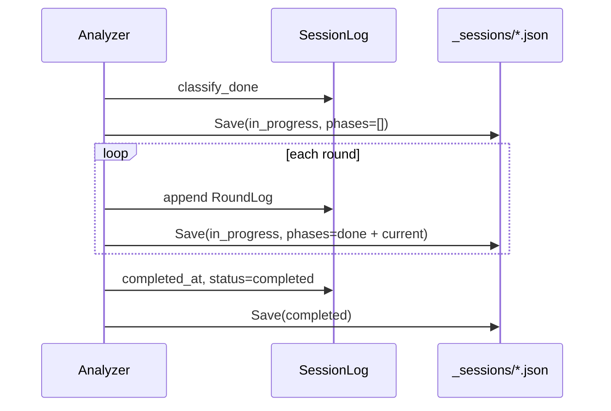

# 009 ImageToMarkdown Incremental Session Log

## 背景 (Background)

- `image-to-markdown` の解析は 1 画像あたり数分かかり、Phase × Round ごとに LLM 呼び出しが発生する。
- 現状、`<output-dir>/_sessions/<basename>_session.json` は **解析完了後に 1 回だけ** `entext.ConvertImageToMarkdown` から書き出される（`analyzer.Analyze` 終了 → `sessionLog.Save`）。
- 長時間変換の途中でエディタや `conversion.log` から進捗を追いかけても、**セッション JSON は古い完了分のまま**または**未作成**のため、`sufficient` や `answer` の途中状態をリアルタイムに確認できない。
- 008 の調査では、Phase 2 の誤 `sufficient: true` をセッションログで発見したが、該当ログは完了後のスナップショットであり、**変換中に気づく手段がなかった**。
- `conversion.log`（stderr の progress）はラウンド単位で追えるが、構造化された `PhaseLog` / `RoundLog` と同等の粒度ではない。

## 要件 (Requirements)

### 必須要件

1. 解析中、セッションログ JSON を **主要チェックポイントごとに上書き保存**すること。最低限、次のタイミングで反映すること:
   - 分類（`category`）確定後
   - 各 Round 終了後（`gap_assessment` / `sufficient` / `question` / `answer` 反映後）
   - 各 Phase 終了後
   - 解析正常完了時（`status: completed`, `completed_at` 設定）
2. 保存先パスは現行契約を維持すること: `<markdown出力ディレクトリ>/_sessions/<basename>_session.json`
3. 進行中の Phase は、完了 Phase と合わせて JSON に含めること（進行中 Phase を `phases` 末尾に含むスナップショット）。
4. JSON に進捗メタデータを追加すること:
   - `status`: `in_progress` | `completed`
   - `last_updated_at`: 各保存時の UTC タイムスタンプ
5. 既存フィールド（`image_path`, `phases`, `rounds`, `gap_assessment`, `sufficient` 等）の構造は **後方互換**を維持すること（フィールド追加のみ）。
6. 保存は **同一ファイルへの原子上書き**（一時ファイル書き込み → rename）とし、読み取り側が途中で壊れた JSON を読まないこと。
7. CLI `image-to-markdown` と公開 API `ConvertImageToMarkdown` の両方で同一挙動とすること。
8. `SessionPersist` コールバック未設定時（単体テスト等）は従来どおりメモリ上のみで動作し、既存テストが壊れないこと。

### 任意要件

1. 解析失敗（`ErrEmptyMarkdown` 等）時も最後の途中状態を `status: failed` で残すこと。
2. `--verbose` 時に `step=session_persist` を stderr に出すこと。
3. バッチ変換で複数画像を並列処理する将来拡張時、画像ごとに独立した `_sessions/<basename>_session.json` を維持すること。

## 実現方針 (Implementation Approach)

### 1. コンポーネント責務

| コンポーネント | 責務 |
| :--- | :--- |
| `internal/imagetomd/analyzer/session.go` | `Snapshot(inProgress *PhaseLog)`、`Save` の原子書き込み、`status` / `last_updated_at` |
| `internal/imagetomd/analyzer/analyzer.go` | チェックポイントで `persistSession` を呼ぶ。`AnalyzeOptions.SessionPersist` を追加 |
| `entext.go` | Markdown 出力パス確定後、`SessionPersist` を `log.Save(sessionDir, basename)` に接続して `Analyze` 前に注入 |

### 2. スナップショット構造



- 進行中: `log.Phases`（完了分）+ `inProgress`（現在 Phase）をマージして保存。
- 完了時: `inProgress` なし。`completed_at` と `status: completed` を設定。

### 3. 後方互換

- 新フィールドは `omitempty` で既存コンシューマに影響を最小化。
- 007/008 の `SessionLog` / `PhaseLog` / `RoundLog` フィールド名は変更しない。

## 検証シナリオ (Verification Scenarios)

1. **単一画像の途中追跡**
   1. `go run ./cmd/image-to-markdown -i tmp/output/pc/images/01_変更履歴.png -o tmp/output/pc/md/01_変更履歴.md --tern-mode inproc --tern-config settings/tern/tern-config.yaml --agent codex --model gpt-5.3-codex --verbose` を実行する。
   2. 変換開始後 30 秒以内に `tmp/output/pc/md/_sessions/01_変更履歴_session.json` が作成されていることを確認する。
   3. ファイルの `last_updated_at` が時間経過とともに更新されることを確認する。
   4. Phase 2 の Round 1 完了後、JSON 内 `phases` に Phase 2 の `rounds[0].gap_assessment` と `sufficient` が反映されていることを確認する。
   5. 変換完了後、`status` が `completed` になり `completed_at` が設定されていることを確認する。

2. **モックによる保存回数**
   1. `analyzer` 単体テストで `SessionPersist` 呼び出し回数が「分類後 + 各ラウンド + 各フェーズ + 完了」以上であることを確認する。

## テスト項目 (Testing for the Requirements)

### ビルド・全体検証

1. ビルド＋単体テスト:
   ```bash
   ./scripts/process/build.sh
   ```

2. analyzer 単体（セッション永続化）:
   ```bash
   go test ./internal/imagetomd/analyzer/... -run 'Session|Persist' -count=1
   ```

3. image-to-markdown / API 回帰:
   ```bash
   ./scripts/process/integration_test.sh --specify "ImageToMarkdown|RootAPI"
   ```

### 要件対応表

| 要件 | 検証 |
| :--- | :--- |
| 1 チェックポイント保存 | `session_test.go`, `analyzer_test.go`（`TestAnalyzePersistsSessionIncrementally`） |
| 2 保存パス契約 | `entext.go` 配線 + 手動シナリオ 1 |
| 3 進行中 Phase 含有 | `SessionLog.Snapshot` 単体テスト |
| 4 status / last_updated_at | `session_test.go` |
| 5 後方互換 | 既存 `TestSessionLogSave` + integration 回帰 |
| 6 原子書き込み | `TestSessionLogSaveWritesAtomically` |
| 7 CLI/API 同等 | `integration_test.sh --specify ImageToMarkdown` |
| 8 コールバック未設定 | 既存 `analyzer_test.go` がパス |
