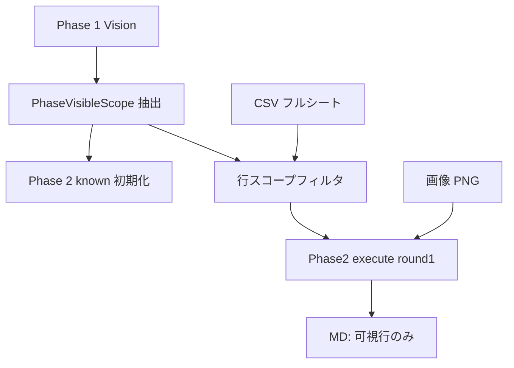

# 012 ImageToMarkdown CSV Visible Scope and Context Efficiency

## 背景 (Background)

- `011-ImageToMarkdown-ExcelCsvHint` により、Excel 由来の CSV を `image-to-markdown` のプロンプトヒントとして利用できるようになった。CSV はシート単位で正しく分解されており、**全シート混在は発生していない**。
- しかし実運用（`tmp/output/pc/images/01_変更履歴.png` + `workbook.sheet-1.csv`）では、画像に写っているのは **No.43・No.44 の2データ行**（+ 空欄行）であるにもかかわらず、出力 MD に **No.1〜44 の全履歴** が混入した。
- 原因は、CSV がシート**全体**のセル値を持ち、プロンプトが「大量データは CSV 転記可」と指示していた一方、**画像の可視行スコープを出力境界として強制する仕組みがなかった**ことにある。Phase 1 で「可視2行」を正しく認識しても、Phase 2 開始時に `known` がリセットされ、CSV 全文付きの execute がシート全行を転記した。
- 加えて、同一 arctic-tern セッション内で会話コンテキストが維持されるにもかかわらず、`known_info` の全文累積と `visionContext`（CSV 全文）の毎ラウンド再送により、プロンプトとセッションログが雪だるま式に肥大化している。
- `010` の変換スコープ（画像忠実度）および `008` の原表再現要件は維持しつつ、**出力行の上限は画像の可視範囲**とし、CSV はその範囲内のセル値補完に限定する必要がある。

### 用語の整理

| 概念 | 定義 |
| :--- | :--- |
| **画像可視スコープ** | 添付 PNG に実際に写っている列構成・データ行・空欄行・入れ子の視覚表現の範囲。出力 Markdown の行・列の上限はここが正とする。 |
| **CSV フルシート** | `excel-to-csv` が出力する 1 シート分の全セル値。画像より広い場合がある（部分スクリーンショット、スクロール途中のキャプチャ等）。 |
| **CSV 参照許可範囲** | 画像可視スコープ内の行について、セル文字列の判読補完に CSV を参照してよい範囲。**可視スコープ外の行を CSV から追加してはならない。** |

## 要件 (Requirements)

### 必須要件

#### A. CSV スコープ制限（情報過剰出力の抑制）

1. CSV ヒントは **画像可視スコープを超える行・列を出力に追加するために使ってはならない**。
2. CSV から転記してよいのは、Phase 1 等で確定した **画像可視スコープ内のデータ行** に限る。空欄行・列見出し・入れ子の有無は引き続き画像 Vision を正とする。
3. プロンプトに **画像可視スコープのメタデータ** を明示すること。最低限含める項目:
   - 可視データ行の識別子（例: `No.43`, `No.44` または行インデックス範囲）
   - 可視行数（ヘッダ除くデータ行 + 空欄行）
   - 列数・列名
4. CSV ヒント本文の注入には **スコープフィルタ** を適用すること。
   - 実装方式は次のいずれか、または組み合わせとする（実装計画で具体化）:
     - (a) Phase 1 サマリに基づく行番号フィルタで CSV を抜粋
     - (b) プロンプト上で「以下 CSV は参照用。可視スコープ外の行は無視せよ」と明示し、注入 CSV はフルシートのまま（フィルタなし）— **ただし出力禁止制約を最優先**とする併記が必須
   - 推奨は (a)。テスト可能な deterministic フィルタを優先する。
5. CSV ヒントの **最大行数 cap**（任意閾値、例: 注入本文 200 行超で truncate + 注記）を設け、プロンプト溢れを防ぐこと。011 任意要件を必須化する。
6. `010` / `008` と矛盾しないこと。ギャップ判定に CSV を含めない方針は維持する。

#### B. プロンプト方針の明確化

7. Phase 2 execute および最終統合において、次を **最優先制約** として明示すること:
   - 「CSV は画像に写っている行のセル値補完にのみ使用する」
   - 「画像に写っていないデータ行を CSV から追加してはならない」
   - 「最終 Markdown のデータ行集合は画像可視スコープの部分集合（一致）でなければならない」
8. `phase2ConversionGapGuide` を修正し、「原表全体が取得済みなら SUFFICIENT」の「全体」を **画像可視スコープ内の全体** に限定すること。CSV フルシートの行数充足は SUFFICIENT 根拠にしてはならない。
9. `phase2CsvExecuteAppend` / `buildCsvHintContext` / `csvFinalSynthesisAppend` の文言を上記方針と整合させること。011 の「大量行は CSV 転記可」は **画像内に大量行が可視の場合** に読み替える。
10. `GenerateMarkdownPrompt` は、Phase 2 で取得した行のうち **画像可視スコープ外の行を最終出力に含めない** よう制約を追加すること。Phase 2 answer に過剰行があっても、最終統合で除去する責務を明記する。

#### C. CSV 付与タイミングの縮小

11. CSV ヒント本文（`buildCsvHintContext` の `--- CSV content ---` ブロック）を付与するのは次に限定すること:
    - Phase 2 の **初回 execute**（round 1）のみ: スコープフィルタ適用後の CSV 本文
    - 最終統合（`GenerateMarkdownPrompt` / retry）: 方針テキストのみ（`csvFinalSynthesisAppend`）。**CSV 全文の再注入はしない**
12. 次のプロンプトには **CSV 本文を付与してはならない**:
    - 分類（classify）
    - Phase 1 / 3 / 4 の execute
    - AssessGap / GenerateQuestion（現行どおり）
13. Phase 2 の round 2 以降の execute では、CSV 本文の代わりに **ファイルパス参照 + スコープメタデータ** のみ付与すること（`visionContext` 重複排除）。

#### D. Phase 間サマリの引き継ぎ

14. Phase 1 完了時に、画像可視スコープの **構造サマリ**（`PhaseVisibleScope` 相当）を抽出・保持すること。最低限:
    - 可視データ行 ID 一覧（例: `43`, `44`）
    - 列数・列名
    - 可視空欄行数
    - 入れ子プレースホルダー一覧
15. Phase 2 開始時の `known` 初期値に、上記サマリを注入すること。Phase 境界での `known=""` リセット後も、可視スコープ情報が Phase 2 のギャップ判定・execute に届くようにする。
16. Phase 3 / 4 開始時も、必要に応じて Phase 1 サマリ（または Phase 2 までの構造サマリ）を `known` 初期値または別フィールドで引き継ぐこと。Phase 3 が Phase 2 の過剰行を構造解析に取り込まないよう、可視スコープを参照可能にする。

#### E. known_info / プロンプト効率化

17. `AssessGapPrompt` に渡す `knownInfo` は、プロンプト送信用に **短縮サマリ** とすること。方針:
    - 同一 arctic-tern セッション内では、直前までの会話履歴が Agent に届く前提とする
    - プロンプト用 `knownInfo` は **構造サマリ + 直近ラウンドの差分**（または直近 1 回答の要約）に限定する
    - Phase 内の全文累積（`known += answer` の丸ごと再送）は廃止する
18. SessionLog 保存用とプロンプト送信用を分離すること。
    - **プロンプト用**: 短縮 `knownInfo`（要件 17）
    - **ログ用**: 従来どおり `answer` 全文を保持してよい。`known_info` フィールドは監査用途に **サマリまたは差分** を保存し、ラウンドごとの全文複製を避ける（要件 19 と整合）
19. SessionLog JSON の肥大化を抑えること。
    - 各 round の `known_info` に過去ラウンド全文を重複保存しない
    - 保存形式は **スコープサマリ + 当該ラウンド開始時点の差分**、または `known_info_chars` / `known_info_summary` 等の圧縮表現とする（後方互換を壊さない追加フィールドを許容）
20. `visionContext` の CSV 全文再送を要件 11〜13 に従い排除すること。`--ref` Markdown 参照の付与方針は変更しない。

#### F. sheet-map と CSV 自動選択

21. `*.sheet-map.json` と CSV ファイル命名を連携し、画像 basename から **対応シートの CSV** を自動解決できること（011 任意要件 1 を必須化）。
    - 例: `01_変更履歴.png` + sheet-map で sheet_index=1 → `workbook.sheet-1.csv` または `<workbook>.sheet-1.csv`
    - 解決規則は `excel-to-csv` 出力命名と一致させる
22. 自動解決時、sheet-map に記載の `sheet_name` / `sheet_index` をプロンプトのスコープメタデータに含めること。
23. 明示 `--csv-hint` が指定された場合は自動解決より優先すること（011 維持）。

#### G. API / CLI 一貫性

24. `image-to-markdown` CLI と `ConvertImageToMarkdown` API で同一ロジックを使用すること。
25. 既存の `--no-csv-hint-auto` / `DisableCsvHintAuto` の挙動を維持すること。

### 任意要件

1. 画像ファイル名や sidecar メタデータ（例: `01_変更履歴.scope.json`）で **明示的な行範囲** をユーザーが指定できるオプション。
2. Phase 1 サマリ抽出を LLM 出力の構造化パースではなく、決定的な regex / 表パターンで行うフォールバック。
3. `excel-to-pdf --with-csv` による CSV 同時出力（011 任意要件 2）— 本仕様の必須スコープ外だが、命名規則は要件 21 と整合させる。

## 実現方針 (Implementation Approach)

### 1. 全体フロー（修正後）

```text
[classify]           visionContext = ref のみ（CSV なし）
[Phase 1 execute]    visionContext = ref のみ
[Phase 1 完了]     → PhaseVisibleScope 抽出・保持
[Phase 2 開始]     known 初期値 = PhaseVisibleScope サマリ
[Phase 2 assess]   knownInfo = 短縮サマリ（全文累積なし）
[Phase 2 execute]  round1: スコープフィルタ済み CSV + 最優先制約
                     round2+: CSV パス参照 + スコープメタのみ
[Phase 3/4]        known 初期値に可視スコープ参照
[final synthesis]  csvFinalSynthesisAppend のみ（CSV 本文なし）
```



### 2. 主要コンポーネント

| コンポーネント | 変更内容 |
| :--- | :--- |
| `internal/imagetomd/csvhint/` | `ResolveCsvHints` 拡張: sheet-map 連携、スコープフィルタ、注入用 excerpt 生成 |
| `internal/imagetomd/analyzer/scope.go`（新規） | `PhaseVisibleScope` 型、Phase 1 回答からのサマリ抽出、Phase 間引き継ぎ |
| `internal/imagetomd/analyzer/csv_context.go` | プロンプト文言修正、付与モード（full / path-only / synthesis-only） |
| `internal/imagetomd/analyzer/prompts.go` | `phase2ConversionGapGuide`、`GenerateMarkdownPrompt` 制約追加 |
| `internal/imagetomd/analyzer/analyzer.go` | CSV 付与タイミング分岐、known 短縮、Phase 初期 known 注入 |
| `internal/imagetomd/analyzer/session.go` | SessionLog 圧縮フィールド（サマリ / 差分） |

### 3. 設計上の重要決定

1. **出力境界は画像可視スコープが正** — CSV はセル値の参照源であり、出力行の許可源ではない。
2. **スコープフィルタは Go 側で可能な限り実施** — LLM の自律判断のみに頼らない。
3. **プロンプト効率化とログ監査を分離** — 短縮は送信用、answer 全文はログ用に残す。
4. **011 との関係** — 011 は「CSV ヒント導入」の基盤仕様。012 はその運用上のスコープ制限とコンテキスト効率化を上書き補足する。矛盾する 011 文言（classify への CSV 付与、無制限転記可）は 012 実装時に修正する。

### 4. 回帰防止

- `02_書き換えルール.png` のように画像内に大量行が可視のケースでは、従来どおり CSV 補完が効くこと。
- `01_変更履歴.png` の部分キャプチャでは No.43/44 のみが出力されること（010/008 の維持項目を満たす）。

## 検証シナリオ (Verification Scenarios)

### シナリオ 1: 部分スクリーンショット + フルシート CSV（主要回帰）

1. `excel-to-csv` で `URL書き換えルール一覧(学生PC).xlsm` から `workbook.sheet-1.csv`（変更履歴）を生成済みとする。
2. 入力画像 `tmp/output/pc/images/01_変更履歴.png`（可視: No.43・44 + 空欄行）に対し、`image-to-markdown` を `--csv-hint workbook.sheet-1.csv` 付きで実行する。
3. 出力 `01_変更履歴.md` を検証する。
4. **合格条件**:
   - データ行に **No.43 と No.44 が含まれる**
   - データ行に **No.1〜42 が含まれない**
   - 9 列構成・空欄行・入れ子展開（No.43/44 の詳細）は 008 水準を維持
   - `秋葉達也` / `藤本華子` / `2025/7/7` / `2025/12/9` が含まれる

### シナリオ 2: CSV 付与タイミング

1. シナリオ 1 と同条件で変換し、記録されたプロンプト（テスト用 recording client またはログ）を確認する。
2. **合格条件**:
   - classify プロンプトに `[Reference csv hint]` および `--- CSV content ---` が **含まれない**
   - Phase 1 execute プロンプトに CSV 本文が **含まれない**
   - Phase 2 round 1 execute にのみスコープ付き CSV 本文が含まれる
   - Phase 2 round 2+ execute はパス参照またはメタのみ（CSV 全文なし）
   - AssessGap プロンプトに CSV が含まれない（現行維持）

### シナリオ 3: Phase 間サマリ引き継ぎ

1. シナリオ 1 のセッションログ `01_変更履歴_session.json` を確認する。
2. **合格条件**:
   - Phase 2 round 1 の `known_info`（または `known_info_summary`）に、Phase 1 で確定した可視行（No.43/44）の情報が含まれる
   - Phase 2 のギャップ判定が「CSV 全44行充足」ではなく「可視2行の転記充足」で収束する

### シナリオ 4: フル可視画像（大量行）

1. 画像内に多数のデータ行が可視なケース（例: `02_書き換えルール.png` + 対応 CSV）で変換する。
2. **合格条件**:
   - 画像に可視の行について CSV 補完が利用され、転記漏れが 011 導入前より改善されている
   - 画像に写っていない行が追加されていない

### シナリオ 5: sheet-map 自動 CSV 解決

1. `01_変更履歴.png` と同ディレクトリ階層に `*.sheet-map.json` および `csv/workbook.sheet-1.csv` を配置する。
2. `--csv-hint` なし（自動解決有効）で変換する。
3. **合格条件**:
   - 変更履歴シートに対応する CSV が自動選択される
   - シナリオ 1 と同様、可視行のみが出力される

### シナリオ 6: known_info / SessionLog 効率化

1. シナリオ 1 を実行し、セッションログを取得する。
2. **合格条件**:
   - 後続ラウンドの `known_info` が過去ラウンド answer 全文の単純連結になっていない（サマリまたは差分形式）
   - AssessGap 用プロンプト（テスト記録）で、ラウンド N の known がラウンド 1..N-1 全文の O(N²) 連結になっていない
   - セッションファイルサイズが、012 適用前の同等変換より有意に小さい（同一画像・同一 Phase 回数で比較）

## テスト項目 (Testing for the Requirements)

### ビルド・全体検証

1. ビルド＋単体テスト:
   ```bash
   scripts/process/build.sh
   ```

2. バックエンド統合テスト（API バリデーション・既存 imagetomd 回帰）:
   ```bash
   scripts/process/integration_test.sh --categories "common" --specify "ImageToMarkdown|CsvHint|ImageToMd"
   ```

### 要件とテストの対応

| 要件 | 検証方法 |
| :--- | :--- |
| A1–A6 CSV スコープ制限 | `internal/imagetomd/csvhint/*_test.go`（行フィルタ、cap、sheet-map 解決）、シナリオ 1 |
| B7–B10 プロンプト最優先制約 | `internal/imagetomd/analyzer/csv_context_test.go`、`prompts_test.go`（文言アサート） |
| C11–C13 CSV 付与タイミング | `analyzer_test.go` recording client テスト（classify/Phase1 に CSV なし、Phase2 round1 のみ本文） |
| D14–D16 Phase 間サマリ | `scope_test.go`（新規）、シナリオ 3 |
| E17–E20 known_info 短縮 | `analyzer_test.go`（プロンプト known サイズ上限）、`session_test.go`、シナリオ 6 |
| F21–F23 sheet-map 自動選択 | `csvhint/resolver_test.go`、シナリオ 5 |
| G24–G25 API 一貫性 | `tests/image_to_markdown_csv_hint_test.go`、`tests/root_api_validation_test.go` |

### 既存テストの更新方針

- `TestAnalyzeInjectsCsvHintOnClassifyAndExecuteNotAssess` は、012 適用後「classify に CSV なし・Phase2 execute に CSV あり」へ期待値を更新する。
- 011 で追加した「classify に CSV 付与」アサーションは削除または反転する。

### E2E（手動相当の自動チェック）

- シナリオ 1 の出力 MD に対し、Go テストまたはスクリプトで次を検証するテストケースを追加する:
  - `No.43` / `No.44` 行の存在
  - `| 1 |` / `| 42 |` パターンの不存在（データ行として）
- LLM 実呼び出し E2E は時間・不安定性的に CI 必須としない。ユニット + プロンプト記録テストを主とし、シナリオ 1 は開発者検証または optional integration で実施する。
