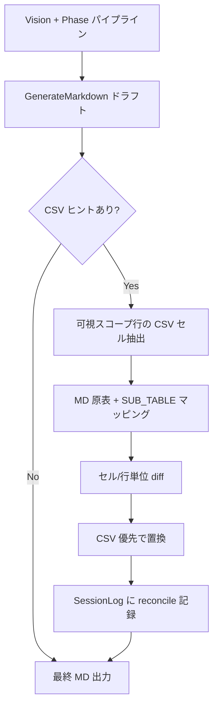

# 013 ImageToMarkdown CSV Cell Reconciliation

## 背景 (Background)

- `012-ImageToMarkdown-CsvVisibleScope-ContextEfficiency` により、CSV ヒントは画像可視スコープ内の行に限定され、No.1〜42 の過剰転記は抑制された。
- しかし `tmp/output/pc/images/01_変更履歴.png` + `workbook.sheet-1.csv` での実運用変換結果（`tmp/output/pc/md/01_変更履歴.md`）では、可視行（No.43/44）の範囲は正しい一方、**入れ子展開セクション `sub_table_p02` 内の正規表現文字列**に誤読が残っている。
  - 出力例: `event¥.html`, `[^¥/]+`
  - CSV セル値（No.44 変更内容欄）: `event\.html`, `[^\/]+`
  - 画像上もバックスラッシュ `\` である可能性が高く、Vision が `\` を全角円記号 `¥`（U+00A5）と誤読したと考えられる。
- 正規表現・URL・エスケープシーケンスを含む技術文書では、`\` と `¥` は**意味が異なる**ため、変換品質上の重大な欠陥である。
- `011` では CSV を「セル値参照源」として Phase 2 に注入しているが、011 の利用ガイドは「CSV と画像が異なる場合は画像優先」とし、**機械抽出 CSV との事後照合・補正プロセス**は定義されていない。
- `010` の変換スコープ（意味校正・正規表現妥当性の検証は対象外）は維持する。本仕様が扱うのは**意味判断ではなく、Excel 由来 CSV に存在する文字列との文字レベル一致**であり、Vision の OCR 誤読（記号の取り違え）を CSV で補正するものである。

### 用語の整理

| 概念 | 定義 |
| :--- | :--- |
| **CSV セル値** | `excel-to-csv` が抽出した、特定行・列に対応するプレーンテキスト。エスケープ文字 `\` を含む。 |
| **Vision 転記** | LLM が画像から読み取り Markdown に書いた文字列。記号の誤読（`\` → `¥` 等）が起きうる。 |
| **照合 (Reconciliation)** | 可視スコープ内の各セルについて、Vision 転記と CSV セル値を比較し、確信度の高い不一致を CSV 側に置き換える決定的後処理。 |
| **既知の混同記号** | Vision が誤読しやすい文字ペア。初期対象: `¥` ↔ `\`（正規表現・パス文脈）。 |

## 要件 (Requirements)

### 必須要件

#### A. 照合プロセスの導入

1. `--csv-hint`（または sheet-map 自動解決）により CSV が利用可能な場合、**最終 Markdown 確定前**に CSV セル値との照合ステップを実行すること。
2. 照合対象は `012` の **画像可視スコープ内のデータ行**に限定すること。可視スコープ外の CSV 行を出力に追加してはならない。
3. 照合は **原表テーブル**および **入れ子展開セクション（`SUB_TABLE_Pxx`）** の両方に適用すること。正規表現の誤読は入れ子展開内に集中しやすい。
4. CSV セル値が存在し、Vision 転記と文字列が不一致の場合、**CSV セル値を正**として Markdown 内の該当箇所を置換すること。
5. 照合は **決定的（deterministic）な Go 実装**とすること。LLM による再解釈・意味校正は行わない（`010` 整合）。
6. `--csv-hint` 未指定時は照合ステップをスキップし、現行どおり Vision 出力のみとすること（後方互換）。

#### B. 照合アルゴリズムの要件

7. CSV から可視スコープ行（`PhaseVisibleScope.VisibleRowIDs`）のセル値を取得し、Markdown 出力の対応セル・入れ子ブロックにマッピングすること。
   - 主キー: `No.` 列の行 ID（例: `43`, `44`）
   - 列: 変更内容(変更理由) 等、Phase 1 で確定した列構成
8. セル値の比較は、**正規化なしの完全一致**を第一とする。不一致時は CSV 値で置換する。
9. 入れ子展開セクション内の行（箇条書き・コードフェンス内の文字列）は、親セル（No.44 変更内容欄）の CSV テキストを**行分割**し、順序・内容で対応付けて置換すること。
   - 例: CSV 内 `^/search/ev_evid([^\/]+)/event\.html(.*)` に対し、MD 内 `^/search/ev_evid([^¥/]+)/event¥.html(.*)` を検出したら CSV 値に置換
10. **既知の混同記号**に限定した部分置換のみを行うモードは任意とするが、必須要件としては **セル単位・行単位の CSV 優先置換**を満たすこと。混同記号リストは拡張可能な設定（定数または設定ファイル）とする。
11. 照合で置換した箇所は、セッションログ（`reconciliation` または `csv_reconcile` フィールド）に **置換前後の diff サマリ**を記録すること（監査・デバッグ用）。

#### C. 012 / 011 / 008 との整合

12. `012` の可視スコープ制約を破らないこと。照合は「既に出力された可視行の文字列修正」のみに用い、行の追加・削除は行わない。
13. `011` の CSV 注入タイミング（Phase 2 round 1 のみ本文）は維持する。照合は **パイプライン後段の後処理**として追加し、プロンプト注入ロジックを再肥大化させない。
14. `008` の原表再現要件と整合すること。照合後の出力は `tests/testdata/reference_parity/01_変更履歴.md` の正規表現行（`event\.html`, `[^/]+` 等）と一致する方向とする。
15. ギャップ判定（AssessGap）入力に CSV 照合結果を含めないこと（`010` 維持）。

#### D. API / CLI

16. CLI `image-to-markdown` と公開 API `ConvertImageToMarkdown` で同一の照合ロジックを使用すること。
17. 照合を無効化する `--no-csv-reconcile` フラグ（任意）を提供してもよい。既定は CSV ヒントあり時 **有効**。

### 任意要件

1. 照合前に Vision 出力と CSV の **Levenshtein 距離**や混同記号出現数をログ出力し、品質メトリクスとする。
2. `<修正前>` vs `＜修正前＞` 等、全角/半角括弧の正規化（CSV 優先）を混同記号リストに追加する。
3. 複数 CSV ヒント指定時の照合優先順位（sheet-map 解決 CSV を最優先等）を resolver と統合する。
4. 照合不能（マッピング失敗）の場合、警告ログのみで Vision 出力を維持する（fail-open）。

## 実現方針 (Implementation Approach)

### 1. 処理フロー



### 2. 主要コンポーネント

| コンポーネント | 配置案 | 責務 |
| :--- | :--- | :--- |
| `ReconcileMarkdownWithCsv` | `internal/imagetomd/csvreconcile/reconcile.go`（新規パッケージ） | 入力 MD + CSV hints + `PhaseVisibleScope` → 補正済 MD + diff ログ |
| `ExtractScopedCells` | `internal/imagetomd/csvreconcile/csv_cells.go` | `FilterCsvByScope` 済み CSV から No.×列のセル値 map を構築 |
| `MapSubTableBlocks` | `internal/imagetomd/csvreconcile/subtable.go` | `### SUB_TABLE_Pxx` セクションと親 No. の対応、CSV セル内行との整列 |
| パイプライン統合 | `internal/imagetomd/analyzer/analyzer.go` または `converter.go` | `GenerateMarkdown` 成功直後に reconcile を呼び出し |

### 3. 設計上の重要決定

1. **後処理方式を採用**: プロンプトに「CSV と一致せよ」と追記するだけでは LLM 非決定論により `\`/`¥` 混在が残る。012 で確立した CSV スコープフィルタ（`csvhint.FilterCsvByScope`）を再利用し、**Go で文字列置換**する。
2. **置換単位**: 入れ子セルは CSV セル全文が改行区切りの複数行テキストであるため、SUB_TABLE 内の対応行（特にバッククォートで囲まれた正規表現行）を CSV 行リストと **最長一致または順序整列**でマッピングする。完全一致する部分文字列が CSV にのみ存在する場合（`event\.html` vs `event¥.html`）は、該当フェンス行全体を CSV 行で置換する。
3. **010 との線引き**: 「正規表現が URL として有効か」「パターンが仕様どおりか」の検証は行わない。CSV に書いてある文字列を MD に写すだけ。
4. **011 との線引き**: 011 はプロンプト注入で LLM に CSV 参照を促す。013 は LLM 出力後の **機械的補正**であり、011 の「画像優先」ガイドと矛盾しない（Vision で構造・レイアウト、CSV でセル値の文字精度）。

### 4. 具体例（01_変更履歴）

| 箇所 | Vision 出力（誤） | CSV セル値（正） |
| :--- | :--- | :--- |
| sub_table_p02 行 | `` `^/search/ev_evid([^¥/]+)/event¥.html(.*)` `` | `^/search/ev_evid([^\/]+)/event\.html(.*)` |
| sub_table_p02 行 | `` `^/search/ev_evid([^¥/]+)/ev_dt([^¥/]+)/event¥.html(.*)` `` | `^/search/ev_evid([^\/]+)/ev_dt([^\/]+)/event\.html(.*)` |

照合後、上記 CSV 値が Markdown に反映されること。

## 検証シナリオ (Verification Scenarios)

### シナリオ 1: 変更履歴 — 正規表現 `\` 誤読の補正（本件）

1. 入力: `tmp/output/pc/images/01_変更履歴.png`
2. CSV ヒント: `tmp/output/pc/csv/URL書き換えルール一覧(学生PC).sheet-1.csv`（`--csv-hint` 明示）
3. `image-to-markdown` で変換し、出力 MD を取得する。
4. **合格条件**:
   - 出力に No.43 / No.44 のみがデータ行として存在し、No.1〜42 は含まれない（012 維持）
   - `sub_table_p02`（または `SUB_TABLE_P02`）展開内に `event¥.html` および `[^¥/]+` が**含まれない**
   - 同セクションに `event\.html` および `[^\/]+` または `[^/]+`（CSV 由来のスラッシュエスケープ表記）が**含まれる**
   - 原表の No.43 行に `^/search/event.html(.*)` が含まれる

### シナリオ 2: CSV ヒントなし — 照合スキップ

1. シナリオ 1 と同一画像で、`--csv-hint` なしで変換する。
2. **合格条件**:
   - 変換が成功する（エラーにならない）
   - 照合ステップは実行されず、セッションログに `csv_reconcile` 記録がない（または `skipped: no_csv_hint`）

### シナリオ 3: 可視スコープ外 CSV 行が追加されない

1. シナリオ 1 を実行する。
2. **合格条件**:
   - 照合後もデータ行は No.43/44 のみ
   - CSV 内の No.42 以前の正規表現文字列が MD に新規出現しない

### シナリオ 4: 参照パリティ golden との整合

1. 照合ロジックのユニットテスト入力として、`tests/testdata/reference_parity/01_変更履歴.md` を **意図的に `¥` 混入版に劣化**させた fixture を用意する。
2. 同一スコープの CSV excerpt と reconcile を実行する。
3. **合格条件**:
   - 出力が golden の正規表現行（33–34 行目相当）と一致する

## テスト項目 (Testing for the Requirements)

### ビルド・全体検証

1. ビルド＋単体テスト:
   ```bash
   scripts/process/build.sh
   ```

2. バックエンド統合テスト（imagetomd / CSV 関連回帰）:
   ```bash
   scripts/process/integration_test.sh --categories "common" --specify "ImageToMarkdown|CsvHint|CsvReconcil|CsvVisible"
   ```

### 要件とテストの対応

| 要件 | 検証方法 |
| :--- | :--- |
| A1–A6 照合プロセス導入 | `internal/imagetomd/csvreconcile/reconcile_test.go`、analyzer 統合テスト（reconcile 呼び出し） |
| B7–B11 照合アルゴリズム | `csv_cells_test.go`、`subtable_test.go`（No.44 正規表現 fixture）、シナリオ 4 |
| C12–C15 012/011/010 整合 | `csv_visible_scope_test.go` 回帰、AssessGap プロンプト記録テスト（CSV reconcile 非注入） |
| D16–D17 API/CLI 一貫性 | `tests/image_to_markdown_csv_hint_test.go` 拡張、`tests/root_api_validation_test.go` |
| `\` vs `¥` 本件 | シナリオ 1 相当の Go テスト: 劣化 MD + CSV → `event\.html` アサート、`event¥.html` 非存在アサート |

### テスト fixture 方針

- CSV 抜粋: `tests/testdata/csv_reconcile/変更履歴_no43_44.csv`（No.43/44 行のみ、または `FilterCsvByScope` 相当）
- 劣化 MD: `tests/testdata/csv_reconcile/01_変更履歴_yen_corruption.md`（`¥` 混入版）
- Golden 期待: `tests/testdata/reference_parity/01_変更履歴.md` の sub_table 正規表現行

### E2E 方針

- LLM 実呼び出し E2E（シナリオ 1 の実 PNG 変換）は CI 必須としない。決定的 reconcile ユニットテストを主とする。
- 開発者検証用に、シナリオ 1 の CLI コマンドを README または実装計画に記載する。
