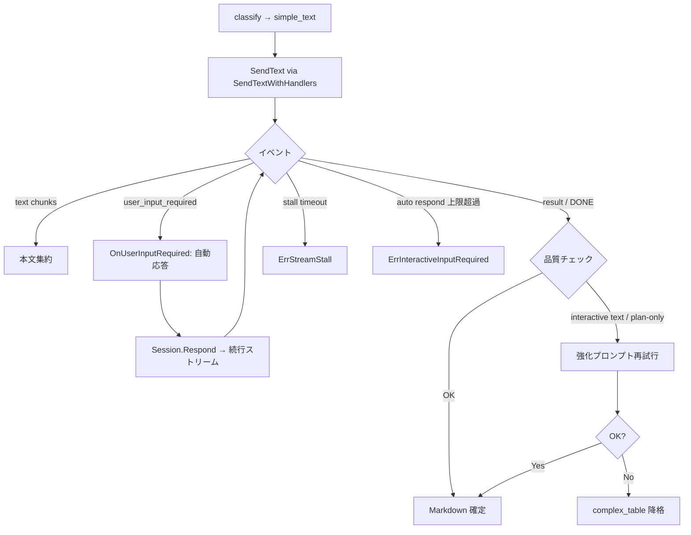

# 014 ImageToMarkdown Non-Interactive Agent Guard

## 背景 (Background)

- `tmp/input` 一括変換において、`tmp/output/pc/images/06_List_出力選択.png` のみが **2 回連続でハング**し、10/11 枚の変換が未完了のまま停止した。
- 画像内容は左上に **2 列 4 行の単純テーブル**（選択 / 列番号、プレナビ 44、プレ管理 47、本ナビ 50）のみであり、解析不能な複雑さではない。
- ログ上の停止箇所はいずれも同一:
  1. `classify_done category=simple_text` まで成功
  2. `step=simple_text_path` で `SendText(ctx, sessionID, SimpleTextPrompt)` を呼び出し
  3. bifrost API リクエストが 3 回発生した後、`stream.Run()` が戻らず無限待ち
  4. `internal/imagetomd/tern/client.go` が `arcticclient.WithNoTimeout()` を使用しており、HTTP クライアント側のタイムアウトがない
  5. 強制終了時に `codex CLI process exited error=0xffffffff` が記録される
- ユーザー仮説: Codex エージェントが **インタラクティブな質問モード**（確認待ち・承認待ち・追加情報要求）に入り、パイプラインがユーザー入力を待ち続けている。画像は単純なのに応答が完了しないことから、この仮説は妥当である。
- **Tern 側の対応状況（2026-07-12 時点）**: `github.com/axsh/arctic-tern v0.1.2` が entext に取り込み済み。`client/v1` に **`user_input_required` イベント**と **`SendTextWithHandlers` / `RunWithHandlers` / `Session.Respond`** によるインタラクティブハンドラループが追加された。06_List のハングは、旧 `stream.Run()` が `user_input_required` を処理できず応答ループに入れないことが直接原因と考えられる。
- 現行 entext 実装の **プロンプト付与の不整合**も寄与している可能性が高い:
  - `classify`: `ClassifyPrompt` + `refContext` + `AttachedImageLine` ✅
  - `simple_text` ショートパス: `SimpleTextPrompt` **のみ**（`ExecutionQuestionSuffix` なし、`AttachedImageLine` なし）❌
  - Phase execute: `question` + `ExecutionQuestionSuffix` + `refContext` + `AttachedImageLine` ✅
  - AssessGap / GenerateQuestion / 最終統合: `ExecutionQuestionSuffix` なし（一部は会話禁止の短文指示のみ）
- 現行 entext `tern/client.go` は **旧 API**（`SendText` → `stream.Run()`）のみ使用しており、v0.1.2 のインタラクティブハンドラを未統合である。
- `007` 以降、plan-only 応答の検知・最終統合リトライ等の **応答品質ガード**は導入済みだが、**インタラクティブ待ち**と **ストリーム無限ハング**に対する横断的ガードは未定義である。
- `009` のセッションログ逐次保存により途中状態は追えるが、ハング時は `simple_text_path` 以降の更新がなく、原因特定は `conversion.log` の progress 行に依存する。

### 用語の整理

| 概念 | 定義 |
| :--- | :--- |
| **インタラクティブ質問モード** | エージェントが最終成果物（Markdown テーブル等）を返さず、確認・選択・追加情報を求める状態。Tern v0.1.2 では **`user_input_required` SSE イベント**として構造化される。 |
| **インタラクティブハンドラループ** | `RunWithHandlers` が `user_input_required` を受信 → `OnUserInputRequired` で応答文字列を生成 → `Session.Respond` で続行ストリームを取得、を `[DONE]` まで繰り返す仕組み。 |
| **無人バッチポリシー** | 本パイプラインでは人間が応答しない。`OnUserInputRequired` は **自動応答**（画像忠実転記を促す固定文）または **明示エラー**（`ErrInteractiveInputRequired`）を返す。 |
| **ストリームスタール** | ハンドラループが `[DONE]` まで進まず、イベント更新が止まる状態。`WithNoTimeout()` 下では無限待ちになりうる。 |
| **非対話実行サフィックス** | 全 LLM 呼び出しに横断付与する、質問・確認・計画説明を禁止し即時データ出力を命じるプロンプト断片。 |
| **応答ガード** | Tern イベント + 受信テキスト解析により、インタラクティブモードを検知して自動応答・リトライ・降格・エラー化する仕組み。 |

### arctic-tern v0.1.2 のインタラクティブ API（Tern 側 — 実装済み）

| API / イベント | 説明 |
| :--- | :--- |
| `EventUserInputRequired` | エージェントがユーザー入力を要求。`UserInputRequiredEvent{Content, PromptID, Choices}` を含む |
| `StreamHandlers` | `OnText`, `OnToolUse`, `OnToolResult`, `OnUserInputRequired`, `OnError`, `OnResult` |
| `Stream.RunWithHandlers(ctx, session, h)` | イベントループ。`user_input_required` 時に `OnUserInputRequired` → `session.Respond` で継続 |
| `Session.SendTextWithHandlers(ctx, msg, h)` | `SendText` + `RunWithHandlers` の便利メソッド |
| `Session.Respond(ctx, content)` | 中断セッションへユーザー応答を POST し、続行ストリームを返す |

**旧 `stream.Run()` の限界**: `EventText` / `EventToolUse` / `EventResult` / `EventError` のみ処理し、**`user_input_required` を無視する**。ハンドラ未設定の `RunWithHandlers` は `"user input required but no handler configured"` で即エラー終了する。

### 責務分担（Tern vs entext）

| 層 | 責務 | 状態 |
| :--- | :--- | :--- |
| **arctic-tern v0.1.2** | SSE イベント正規化、`user_input_required` 検出、Respond ループ、ツール結果イベント | ✅ 実装済み |
| **entext `tern/client.go`** | `SendTextWithHandlers` ベースへ移行。無人バッチ用 `OnUserInputRequired` 注入。タイムアウト。イベント verbose ログ | ❌ 未実装 |
| **entext `analyzer/`** | 非対話プロンプト横断付与、`simple_text` 画像再添付、応答品質ガード（plan-only / interactive テキスト）、降格 | ❌ 未実装 |

## 要件 (Requirements)

### 必須要件

#### A. プロンプトによる抑制（entext / analyzer — 横断適用）

1. **全 LLM 呼び出し**に、非対話実行サフィックスを付与すること。対象は最低限:
   - 分類（`ClassifyPrompt`）
   - `simple_text` ショートパス（`SimpleTextPrompt`）
   - AssessGap（`AssessGapPrompt`）
   - GenerateQuestion（`GenerateQuestionPrompt`）
   - Phase execute（既存 `ExecutionQuestionSuffix` を統合）
   - 最終統合（`GenerateMarkdownPrompt` / `GenerateMarkdownRetryPrompt`）
2. 非対話実行サフィックスは **単一定数**（例: `NonInteractiveExecutionSuffix`）として `prompts.go` に定義し、`ExecutionQuestionSuffix` を吸収または置換すること。
3. サフィックスに含める禁止事項（最低限）:
   - ユーザーへの質問・確認要求
   - 計画・前置き・承諾のみの応答
   - 追加情報の要求・対話待ち
4. サフィックスに含める必須事項:
   - **即時に要求された形式のみを出力**すること
   - 本パイプラインは **無人バッチ実行**であり、人間の応答は来ないこと
5. `simple_text` ショートパスは Phase execute と **同等の画像参照**を付与すること:
   - `SimpleTextPrompt` + `refContext` + `AttachedImageLine(absPath)` + 非対話実行サフィックス
6. `007`〜`013` の既存プロンプト契約は維持すること。

#### B. Tern クライアント統合（entext / tern — v0.1.2 ハンドラ利用）

7. `internal/imagetomd/tern/client.go` の `SendText` を **`SendTextWithHandlers` ベース**に移行すること。旧 `stream.Run()` 単体経路は廃止する。
8. 無人バッチ用 **`OnUserInputRequired` ハンドラ**を必ず設定すること。方針（実装計画で具体化）:
   - **既定（推奨）**: 固定の自動応答文を `Session.Respond` 経由で返し、変換を継続する。
     - 例: 「無人バッチ実行です。確認不要。添付画像を忠実に Markdown 化し、質問せずテーブル/リストを即時出力してください。」
   - **選択肢付き質問**（`Choices` 非空）: 先頭選択肢、または画像忠実転記を優先する決定的ルールで 1 件を選ぶ。
   - **上限**: 1 `SendText` 呼び出しあたりの `user_input_required` 自動応答回数に上限（例: 3 回）。超過時は `ErrInteractiveInputRequired`。
9. `user_input_required` 発火時、セッションログ / verbose progress に記録すること:
   - `step=agent_guard kind=user_input_required prompt_id=<id> choices=<n> auto_response=<bool>`
   - `agent_guard` に `content`（質問文の先頭 N 文字）を保存
10. `OnToolUse` / `OnToolResult` を登録し、verbose 時に `step=stream_tool_use tool=<name>` を出力すること。
11. **旧来のテキストヒューリスティック** `looksLikeInteractiveQuestion` も **補助層**として維持すること（`user_input_required` イベントが来ず、質問文だけが `OnText` に流れた場合の検知）。plan-only との統合再試行フローは従来どおり。
12. `simple_text` パスで interactive（イベントまたはテキスト）または plan-only が検知され、自動応答・再試行後も不十分な場合、**complex_table パスへ降格**すること。降格理由を `simple_text_fallback` に記録する。

#### C. タイムアウトと安全網

13. `WithNoTimeout()` の無制限待ちを廃止し、**コンテキストまたは SendText 単位のデッドライン**を適用すること。
14. ハンドラループ全体（複数回の `Respond` を含む）に **総タイムアウト**を設けること（例: 600s）。部分イベント間のアイドルタイムアウト（例: 120s）も任意で設ける。
15. タイムアウト時は `ErrStreamStall`（または同等）を返し、無限ハングを禁止する。
16. タイムアウト値は `AnalyzeOptions` / `tern.SendOptions` で上書き可能とし、単体テストでは短い値を注入できること。
17. **stall** 時の `simple_text` 降格は行わない（応答テキストまたはイベントが得られたが品質不十分な場合のみ降格）。

#### D. 後方互換と契約

18. 非対話ガードは `image-to-markdown` CLI と `ConvertImageToMarkdown` API の両方に同一適用すること。
19. `tern.Client` インターフェース（`SendText(ctx, sessionID, text) (string, error)`）は **analyzer から見た契約を維持**すること。内部実装のみ `SendTextWithHandlers` へ移行。
20. `--verbose` 時に `step=agent_guard_*` 系 progress を出力すること。
21. 既存のゴールデンテスト・契約テスト（`007`/`008` 等）を破壊しないこと。
22. 依存バージョン: `github.com/axsh/arctic-tern v0.1.2` 以上を要求すること（`go.mod` 反映済み）。

### 任意要件

1. `OnSystem` / `node_*` / `progress` イベントを verbose ログに記録する。
2. Codex 側の `--ask-for-approval never` 相当が arctic-tern セッション作成時に指定可能なら注入する。
3. stall / interactive 上限超過時にセッションを `Terminate` してからリトライする。
4. `agent_guard` メトリクス（`user_input_required` 回数、自動応答率、stall 率）を変換サマリに出力する。
5. `UserInputRequiredEvent.Choices` をセッションログに保存し、デバッグ可能にする。

## 実現方針 (Implementation Approach)

### 1. 処理フロー（Tern ハンドラ統合 + simple_text）



### 2. 主要コンポーネント

| コンポーネント | 配置 | 責務 |
| :--- | :--- | :--- |
| `SendTextWithHandlers` ラッパ | `internal/imagetomd/tern/client.go` | v0.1.2 API 利用。本文集約、`OnUserInputRequired` 注入、タイムアウト |
| `UnattendedInputHandler` | `internal/imagetomd/tern/interactive.go`（新規） | 自動応答文生成、Choices 選択、回数上限 |
| `NonInteractiveExecutionSuffix` | `internal/imagetomd/analyzer/prompts.go` | 横断プロンプト抑制 |
| `buildSendPrompt` | `internal/imagetomd/analyzer/analyzer.go` | 画像行・refContext・サフィックス一貫付与 |
| `looksLikeInteractiveQuestion` | `internal/imagetomd/analyzer/quality.go` | テキストベース補助検知 |
| `simple_text` 降格 | `internal/imagetomd/analyzer/analyzer.go` | 再試行失敗時 complex 経路へ |
| SessionLog 拡張 | `internal/imagetomd/analyzer/session.go` | `agent_guard` / `simple_text_fallback` |

### 3. `tern/client.go` 移行設計

```go
// 概念スケッチ（実装計画で具体化）
func (c *ArcticClient) SendText(ctx context.Context, sessionID, text string) (string, error) {
    session, err := c.getSession(sessionID)
    // ...
    var texts []string
    opts := c.sendOptions // timeout, maxAutoResponses, progress callback
    handlers := arcticclient.StreamHandlers{
        OnText: func(chunk string) { /* append */ },
        OnUserInputRequired: c.unattendedHandler.OnUserInputRequired,
        OnToolUse: func(name string) { /* log */ },
        OnResult: func() { /* mark done */ },
    }
    err = session.SendTextWithHandlers(ctxWithDeadline(ctx, opts), text, handlers)
    return finalizeResponse(texts, ""), err
}
```

**06_List ハングの想定修正**: Codex が `user_input_required` を送出 → 旧 `Run()` では無視され SSE が `[DONE]` まで到達しない → 無限待ち。**新経路**では `OnUserInputRequired` が自動応答 → `Respond` → 変換継続。

### 4. 自動応答ポリシー（無人バッチ）

| 状況 | 自動応答方針 |
| :--- | :--- |
| 自由記述の確認質問 | 非対話サフィックスと同等の「確認不要・画像忠実転記・即時出力」固定文 |
| `Choices` あり | 画像内容と整合する選択肢を優先。決定不能なら先頭 + verbose 警告 |
| 同一 SendText 内で繰り返し | 回数上限（例: 3）。超過 → `ErrInteractiveInputRequired` |
| 自動応答後も plan-only / 空 MD | analyzer 側の再試行 → `simple_text` 降格 |

### 5. 検知の多層防御（改訂）

| 層 | 手段 | 検知対象 | 提供元 |
| :--- | :--- | :--- | :--- |
| 1 予防 | 非対話プロンプト | 質問形式の明示的応答 | entext analyzer |
| 2 構造化 | `user_input_required` イベント | インタラクティブ待ち（主因） | arctic-tern v0.1.2 |
| 3 自動回復 | `OnUserInputRequired` + `Respond` | 上記の無人解決 | entext tern |
| 4 補助 | `looksLikeInteractiveQuestion` | イベントなし質問テキスト | entext analyzer |
| 5 安全網 | ハンドラループ総タイムアウト | 無限ハング | entext tern |

**結論**: v0.1.2 により **インタラクティブモードの構造化検知が可能**になった。entext 側はハンドラ統合を最優先とし、プロンプト抑制・テキストヒューリスティック・タイムアウトは従来どおり多層防御として維持する。

### 6. `06_List_出力選択` との関係

- 分類 `simple_text` は妥当。
- ハング原因は **解析不能**ではなく **`user_input_required` 未処理 + 無タイムアウト** とみなす。
- 014 適用後の期待:
  1. `SendTextWithHandlers` + 自動応答で `06_List` が完了
  2. それでも失敗する場合、600s 以内に typed error で終了（無限待ちしない）
  3. プロンプト修正（画像再添付・非対話サフィックス）で `user_input_required` 自体の発生率を下げる

## 検証シナリオ (Verification Scenarios)

1. **再現確認（014 未適用・記録用）**
   1. 旧 `stream.Run()` 経路で `06_List_出力選択.png` を実行。
   2. `step=simple_text_path` 後に長時間進捗が止まる既知事象を確認（回帰テストのベースライン）。

2. **014 適用後の 06_List 完了**
   1. `06_List_出力選択.png` に対し `image-to-markdown` を実行。
   2. 無限ハングせず、成功または typed error で終了。
   3. 成功時、出力 MD に `選択`/`列番号` 見出しと `プレナビ/44`、`プレ管理/47`、`本ナビ/50` を含む。
   4. verbose ログに `user_input_required` 自動応答が記録されていれば、その内容を確認（発生しなくても成功は許容）。

3. **SendTextWithHandlers 統合（モック / httptest）**
   1. SSE ストリームが `user_input_required` → 続行 `text` → `[DONE]` を返すスタブを用意。
   2. `tern/client.go` が自動応答後に最終テキストを返すこと。
   3. `OnUserInputRequired` 未設定相当（旧 Run 経路）ではハングまたはエラーになること（回帰確認）。

4. **自動応答上限**
   1. 連続 4 回 `user_input_required` を返すスタブ。
   2. 3 回まで自動応答、4 回目で `ErrInteractiveInputRequired`。

5. **simple_text プロンプト付与（モック Client）**
   1. 2 回目 `SendText` プロンプトに `Attached image:` と非対話サフィックスが含まれること。

6. **テキストベース interactive 検知と降格**
   1. イベントなしで `Could you confirm...?` のみ返すモック → 再試行 → 降格。

7. **ストリームスタールタイムアウト**
   1. イベント無しスタブ + 短い deadline → `ErrStreamStall`。

8. **回帰: 01_変更履歴 complex_table 経路**
   1. 非対話ガード追加後も No.43/44 行が出力されること。

## テスト項目 (Testing for the Requirements)

### ビルド・全体検証

1. ビルド＋単体テスト:
   ```bash
   scripts/process/build.sh
   ```

2. tern + analyzer 単体:
   ```bash
   go test ./internal/imagetomd/tern/... ./internal/imagetomd/analyzer/... -count=1
   ```

3. 契約回帰:
   ```bash
   scripts/process/integration_test.sh --categories "common" --specify "ImageToMarkdown|imagetomd|image-to-markdown"
   ```

### 要件と検証の対応

| 要件 | 検証方法 |
| :--- | :--- |
| A1–A6 プロンプト抑制 | `TestSimpleTextPromptIncludesNonInteractiveSuffixAndImage` |
| B7–B10 SendTextWithHandlers 統合 | `TestSendTextHandlesUserInputRequired`（`tern/client_test.go` + SSE スタブ） |
| B11 テキスト補助検知 | `TestLooksLikeInteractiveQuestion_*` |
| B12 simple_text 降格 | `TestSimpleTextFallsBackToComplexTable` |
| C13–C17 タイムアウト | `TestSendTextReturnsErrOnStreamStall`, `TestSendTextRespectsTotalDeadline` |
| D18–D22 CLI/API 契約 | `tests/image_to_markdown_logging_test.go` + integration_test |
| 06_List | モック SSE で `user_input_required` シナリオを再現する契約テスト（CI 必須）。実 LLM E2E は Nightly 任意 |

### Nightly / 任意（実 LLM）

```bash
go run ./cmd/image-to-markdown --tern-mode inproc \
  -i tmp/output/pc/images/06_List_出力選択.png \
  --output-dir tmp/output/pc/md --verbose
```

成功条件: 10 分以内に終了し、出力 MD に 3 データ行が含まれること。
