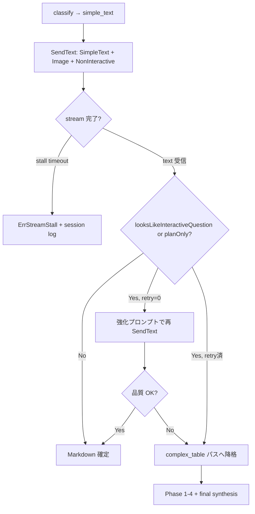

# 014 ImageToMarkdown Non-Interactive Agent Guard

## 背景 (Background)

- `tmp/input` 一括変換において、`tmp/output/pc/images/06_List_出力選択.png` のみが **2 回連続でハング**し、10/11 枚の変換が未完了のまま停止した。
- 画像内容は左上に **2 列 4 行の単純テーブル**（選択 / 列番号、プレナビ 44、プレ管理 47、本ナビ 50）のみであり、解析不能な複雑さではない。
- ログ上の停止箇所はいずれも同一:
  1. `classify_done category=simple_text` まで成功
  2. `step=simple_text_path` で `SendText(ctx, sessionID, SimpleTextPrompt)` を呼び出し
  3. bifrost API リクエストが 3 回発生した後、`stream.Run()` が戻らず無限待ち
  4. `internal/imagetomd/tern/client.go` が `arcticclient.WithNoTimeout()` を使用しており、HTTP クライアント側のタイムアウトがない
  5. 強制終了時に `codex CLI process exited error=0xffffffff` が記録される
- ユーザー仮説: Codex エージェントが **インタラクティブな質問モード**（確認待ち・承認待ち・追加情報要求）に入り、パイプラインがユーザー入力を待ち続けている。画像は単純なのに応答が完了しないことから、この仮説は妥当である。
- 現行実装の **プロンプト付与の不整合**が寄与している可能性が高い:
  - `classify`: `ClassifyPrompt` + `refContext` + `AttachedImageLine` ✅
  - `simple_text` ショートパス: `SimpleTextPrompt` **のみ**（`ExecutionQuestionSuffix` なし、`AttachedImageLine` なし）❌
  - Phase execute: `question` + `ExecutionQuestionSuffix` + `refContext` + `AttachedImageLine` ✅
  - AssessGap / GenerateQuestion / 最終統合: `ExecutionQuestionSuffix` なし（一部は会話禁止の短文指示のみ）
- `007` 以降、plan-only 応答の検知・最終統合リトライ等の **応答品質ガード**は導入済みだが、**インタラクティブ待ち**と **ストリーム無限ハング**に対する横断的ガードは未定義である。
- `009` のセッションログ逐次保存により途中状態は追えるが、ハング時は `simple_text_path` 以降の更新がなく、原因特定は `conversion.log` の progress 行に依存する。

### 用語の整理

| 概念 | 定義 |
| :--- | :--- |
| **インタラクティブ質問モード** | エージェントが最終成果物（Markdown テーブル等）を返さず、確認・選択・追加情報を求める応答、またはツール実行・承認待ちによりストリームが完了しない状態。 |
| **ストリームスタール** | `stream.Run()` が `[DONE]` マーカーなくブロックし続ける状態。`OnText` / `OnResult` が一定時間更新されない。 |
| **非対話実行サフィックス** | 全 `SendText` 呼び出しに横断付与する、質問・確認・計画説明を禁止し即時データ出力を命じるプロンプト断片。現行の `ExecutionQuestionSuffix` を拡張・統合したもの。 |
| **応答ガード** | 受信テキストまたはストリームイベントを解析し、インタラクティブモードを検知してリトライ・降格・エラー化する仕組み。 |

### arctic-tern ストリームで観測可能なシグナル

`github.com/axsh/arctic-tern/client/v1` の `EventType` には、現行 `tern/client.go` が **未処理**のイベントがある:

| EventType | 意味（推定） | 現行の扱い |
| :--- | :--- | :--- |
| `text` | 本文チャンク | `OnText` で処理 ✅ |
| `result` | 完了結果 | `OnResult` で処理 ✅ |
| `error` | エラー | `OnError` で処理 ✅ |
| `tool_use` | ツール呼び出し | **未処理**（ハンドラ未登録） |
| `system` | システムメッセージ | **未処理** |
| `node_start` / `node_complete` / `node_failed` | ノード進行 | **未処理** |
| `progress` | 進捗（WBS 等） | **未処理** |

インタラクティブ待ちは、(a) 応答テキストが質問形式、(b) `tool_use` 後に完了しない、(c) いずれのイベントも来ずスタール、のいずれかで現れると想定する。**専用の `interactive_question` イベント型は存在しない**ため、複合ヒューリスティックが必要である。

## 要件 (Requirements)

### 必須要件

#### A. プロンプトによる抑制（横断適用）

1. **全 `SendText` 呼び出し**に、非対話実行サフィックスを付与すること。対象は最低限:
   - 分類（`ClassifyPrompt`）
   - `simple_text` ショートパス（`SimpleTextPrompt`）
   - AssessGap（`AssessGapPrompt`）
   - GenerateQuestion（`GenerateQuestionPrompt`）
   - Phase execute（既存 `ExecutionQuestionSuffix` を統合）
   - 最終統合（`GenerateMarkdownPrompt` / `GenerateMarkdownRetryPrompt`）
2. 非対話実行サフィックスは **単一定数**（例: `NonInteractiveExecutionSuffix`）として `prompts.go` に定義し、`ExecutionQuestionSuffix` を吸収または置換すること。重複付与を避けるラッパー（例: `WrapNonInteractivePrompt(base string) string`）を設けること。
3. サフィックスに含める禁止事項（最低限）:
   - ユーザーへの質問・確認要求（「〜ですか？」「どちらを選びますか」等）
   - 計画・前置き・承諾のみの応答（`I will`, `確認します`, `承知しました` 等）
   - 追加情報の要求
   - 対話を前提とした待機
4. サフィックスに含める必須事項:
   - **即時に要求された形式（Markdown テーブル / リスト / 判定語）のみを出力**すること
   - 本パイプラインは **無人バッチ実行**であり、人間の応答は来ないこと
5. `simple_text` ショートパスは Phase execute と **同等の画像参照**を付与すること:
   - `SimpleTextPrompt` + `refContext`（CSV ヒント文脈がある場合）+ `AttachedImageLine(absPath)` + 非対話実行サフィックス
6. `007`〜`013` の既存プロンプト契約（変換スコープ、CSV 可視スコープ、ギャップ判定語、原表再現制約等）は維持すること。非対話サフィックスは **追加**であり、既存制約を上書きしない。

#### B. ストリーム・応答の検知

7. `SendText` に **ストリームスタール検知**を導入すること:
   - 初回 `OnText` / `OnResult` / `tool_use` / `system` 受信まで、および最終 `[DONE]` までの **最大待機時間**を設定する（既定値は実装計画で決定。例: 初動 120s、全体 600s）。
   - タイムアウト時は `ErrStreamStall`（または同等の typed error）を返し、無限ハングを禁止する。
8. `tern/client.go` で `OnToolUse` を登録し、`tool_use` イベントを記録すること。`--verbose` 時は `step=stream_tool_use tool=<name>` を stderr に出力すること。
9. 受信テキストに対し **`looksLikeInteractiveQuestion(text string) bool`** を実装すること。検知パターンの例（実装で拡張可能）:
   - 文末が `?` / `？` で、Markdown テーブル行（`|...|`）やリスト行（`- `）を含まない
   - `確認してください` / `教えてください` / `どちら` / `選択してください` / `please confirm` / `which one` / `could you`
   - `y/n` / `yes/no` の選択要求
   - 応答が極端に短く（例: 200 文字未満）、データ行を含まず疑問文のみ
10. 既存の `looksLikePlanOnly` と連携し、plan-only **または** interactive-question の場合は **同一の再試行フロー**に載せること（execute ラウンドでは現行どおり再質問生成へ）。
11. `simple_text` パスで interactive-question または plan-only が検知された場合、**1 回**は強化プロンプトで再試行すること。再試行でも不十分なら **complex_table パスへ降格**（Phase 1-4 + 最終統合を実行）すること。降格はセッションログに `simple_text_fallback: complex_table reason=<...>` として記録する。
12. ストリームスタール・interactive 検知時、セッションログに `agent_guard` フィールド（または同等）で `kind`, `reason`, `retry_count`, `elapsed_ms` を記録すること。

#### C. タイムアウトとクライアント設定

13. `WithNoTimeout()` の無制限待ちを廃止し、**コンテキストまたは SendText 単位のデッドライン**を適用すること。`CreateSession` / `Health` 等の短い呼び出しは従来どおり短タイムアウトでよい。
14. タイムアウト値は `AnalyzeOptions`（または `tern.SendOptions`）で上書き可能とし、単体テストでは短い値を注入できること。
15. CLI / API の既定挙動は **fail on stall**（エラー終了）とする。`simple_text` 降格は stall ではなく **応答テキストが得られたが品質不十分**な場合に適用する。

#### D. 後方互換と契約

16. 非対話ガードは `image-to-markdown` CLI と `ConvertImageToMarkdown` API の両方に同一適用すること。
17. `--verbose` 時に `step=agent_guard_*` 系の progress を出力し、`conversion.log` からガード発火を追跡可能にすること。
18. 既存のゴールデンテスト・契約テスト（`007`/`008` の参照パリティ等）を破壊しないこと。

### 任意要件

1. `OnSystem` / `node_*` / `progress` イベントを verbose ログに記録し、将来のインタラクティブモード分類に利用する。
2. Codex 側の `--ask-for-approval never` 相当の設定が arctic-tern / bifrost 経由で指定可能なら、セッション作成時に注入する（調査結果次第で実装計画に記載）。
3. ストリール発生時にセッションを `Terminate` してからリトライし、ゾンビセッションを防ぐ。
4. `agent_guard` のメトリクス（stall 率、interactive 検知率）を変換サマリ JSON に出力する。

## 実現方針 (Implementation Approach)

### 1. 処理フロー（simple_text 重点）



### 2. 主要コンポーネント

| コンポーネント | 配置 | 責務 |
| :--- | :--- | :--- |
| `NonInteractiveExecutionSuffix` / `WrapNonInteractivePrompt` | `internal/imagetomd/analyzer/prompts.go` | 横断プロンプト抑制。`ExecutionQuestionSuffix` 統合 |
| `buildSendPrompt(step, base, ctx)` | `internal/imagetomd/analyzer/analyzer.go` | 各 `SendText` 前に画像行・refContext・サフィックスを一貫付与 |
| `looksLikeInteractiveQuestion` | `internal/imagetomd/analyzer/quality.go` | 応答テキストのインタラクティブ検知 |
| `SendOptions` / stall watchdog | `internal/imagetomd/tern/client.go` | タイムアウト、`OnToolUse`、イベント記録、`ErrStreamStall` |
| `simple_text` 降格 | `internal/imagetomd/analyzer/analyzer.go` | 再試行失敗時に `category` を上書きせず complex 経路へ分岐 |
| SessionLog 拡張 | `internal/imagetomd/analyzer/session.go` | `agent_guard` / `simple_text_fallback` フィールド追加 |

### 3. プロンプト横断付与の設計

現行の付与マトリクスと目標:

| ステップ | 現行 | 014 後 |
| :--- | :--- | :--- |
| classify | 画像 + refContext | + 非対話サフィックス |
| simple_text | プロンプトのみ | + 画像 + refContext + 非対話サフィックス |
| assess_gap | 短文の会話禁止のみ | + 非対話サフィックス |
| generate_question | ルール内に会話禁止 | + 非対話サフィックス |
| execute | ExecutionQuestionSuffix + 画像 + refContext | サフィックスを統一定数へ移行 |
| final / retry | データ忠実制約のみ | + 非対話サフィックス |

**非対話サフィックス案（実装時に英日混在で調整可）:**

```
**CRITICAL — UNATTENDED BATCH MODE**
- Do NOT ask questions or request confirmation. No human is available to answer.
- Do NOT plan, explain, or say "I will…" / "確認します". Output the requested data immediately.
- If information seems ambiguous, choose the most faithful transcription from the attached image and proceed.
- Output ONLY the requested format (Markdown table / list / category name / SUFFICIENT|INSUFFICIENT).
```

### 4. 検知の限界と方針

| 手段 | 検知できるもの | 限界 |
| :--- | :--- | :--- |
| プロンプト抑制 | 質問形式の明示的応答 | モデル非遵守、無言スタール |
| `looksLikeInteractiveQuestion` | テキストとして返った質問 | 空応答・スタールは検知不可 |
| `OnToolUse` | ツール実行フェーズ | ツール名とインタラクティブの対応はエージェント依存 |
| ストリームスタール timeout | 無限ハング | 遅いが正常な応答を誤検知しないよう閾値調整が必要 |

**結論**: インタラクティブモードを **100% の精度で事前検知する API はない**。本仕様は **プロンプト抑制（予防）+ スタールタイムアウト（安全網）+ 応答ヒューリスティック（事後検知）+ simple_text 降格（回復）** の多層防御とする。

### 5. `06_List_出力選択` との関係

- 分類 `simple_text` は妥当（小さな一覧表）。
- ハングは **解析不能**ではなく **エージェント応答完了失敗**とみなす。
- 014 適用後の期待挙動:
  1. `simple_text` でも画像パス・非対話サフィックス付きで変換
  2. スタール時は 600s 以内に `ErrStreamStall` で失敗（無限待ちしない）
  3. 質問形式応答なら再試行 → 降格で complex 経路が完了まで進む

## 検証シナリオ (Verification Scenarios)

1. **再現確認（現状の問題固定化）**
   1. 現行（014 未適用）ビルドで `tmp/output/pc/images/06_List_出力選択.png` を `image-to-markdown` 実行する。
   2. `step=simple_text_path` の後に長時間（例: 10 分以上）進捗が更新されないことを確認する（既知の事象として記録）。

2. **014 適用後の 06_List 完了**
   1. `06_List_出力選択.png` に対し `image-to-markdown` を実行する。
   2. 無限ハングせず、成功またはタイムアウトエラーで終了する。
   3. 成功時、出力 MD に次を含む:
      - Markdown テーブル形式
      - 列見出し `選択` と `列番号`
      - 行 `プレナビ` / `44`、`プレ管理` / `47`、`本ナビ` / `50`
   4. セッションログ `_sessions/06_List_出力選択_session.json` が `simple_text_path` 以降も更新される。

3. **simple_text プロンプト付与の確認（モック Client）**
   1. `queueClient` を用いた単体テストで `category=simple_text` の画像を解析する。
   2. 2 回目の `SendText` に渡るプロンプトに `Attached image:` と非対話サフィックスのキーフレーズが含まれることを検証する。

4. **インタラクティブ応答の検知と再試行**
   1. モック Client が `simple_text` 2 回目で `Could you confirm which column to use?` を返す設定にする。
   2. `looksLikeInteractiveQuestion` が true となり、強化プロンプトでの再 `SendText` が発生することを検証する。
   3. 3 回目で正常な Markdown テーブルを返すと最終 MD が得られること。

5. **simple_text → complex_table 降格**
   1. モック Client が `simple_text` 経路で 2 回連続インタラクティブ応答を返す設定にする。
   2. Phase 1-4 経路に切り替わり、セッションログに `simple_text_fallback` が記録されること。

6. **ストリームスタールタイムアウト**
   1. テスト用 `SendText` が `OnText` も `[DONE]` も返さないスタブを用意する。
   2. 短い `stall_timeout` で `ErrStreamStall` が返ること。
   3. プロセスが無限ブロックしないこと。

7. **回帰: 01_変更履歴 complex_table 経路**
   1. `tmp/entext-test/images/pc/01_変更履歴.png`（または同等テストデータ）で変換品質が `008` 契約を満たすこと。
   2. 非対話サフィックス追加後も No.43/44 行が出力されること。

8. **横断付与の網羅確認**
   1. プロンプトラッパ経由で classify / assess / execute / final の各ステップが `WrapNonInteractivePrompt` を通ることを静的テストまたはモックインデックスで確認する。

## テスト項目 (Testing for the Requirements)

### ビルド・全体検証

1. ビルド＋単体テスト:
   ```bash
   scripts/process/build.sh
   ```

2. ImageToMarkdown 関連の単体テスト（プロンプト付与・品質ガード・モック解析）:
   ```bash
   go test ./internal/imagetomd/analyzer/... ./internal/imagetomd/tern/... -count=1
   ```

3. 契約・参照パリティ回帰（common カテゴリ内の imagetomd 系）:
   ```bash
   scripts/process/integration_test.sh --categories "common" --specify "ImageToMarkdown|imagetomd|image-to-markdown"
   ```

### 要件と検証の対応

| 要件 | 検証方法 |
| :--- | :--- |
| A1–A6 横断プロンプト抑制 | `TestSimpleTextPromptIncludesNonInteractiveSuffixAndImage`（新規）、`go test ./internal/imagetomd/analyzer/...` |
| B7 ストリームスタール検知 | `TestSendTextReturnsErrOnStreamStall`（`tern/client_test.go` 新規） |
| B8 tool_use 記録 | `TestSendTextRecordsToolUse`（新規）、verbose ログ契約テスト |
| B9–B11 interactive 検知・降格 | `TestLooksLikeInteractiveQuestion_*`、`TestSimpleTextFallsBackToComplexTable`（`quality_test.go` / `analyzer_test.go`） |
| B12 セッションログ | `TestSessionLogRecordsAgentGuard`（新規） |
| C13–C15 タイムアウト設定 | `tern` パッケージ単体テスト + `build.sh` |
| D16–D18 CLI/API 契約 | `tests/image_to_markdown_logging_test.go` + integration_test `common` |
| 06_List 実画像シナリオ | 手動ではなく、モックで simple_text 経路を再現する契約テストを必須とし、実 LLM E2E は Nightly 任意 |

### Nightly / 任意（実 LLM）

```bash
# 外部 tern + 実モデルが利用可能な環境のみ
go run ./cmd/image-to-markdown --tern-mode inproc -i tmp/output/pc/images/06_List_出力選択.png --output-dir tmp/output/pc/md --verbose
```

成功条件: 10 分以内に終了し、出力 MD にプレナビ/プレ管理/本ナビの 3 行が含まれること。
