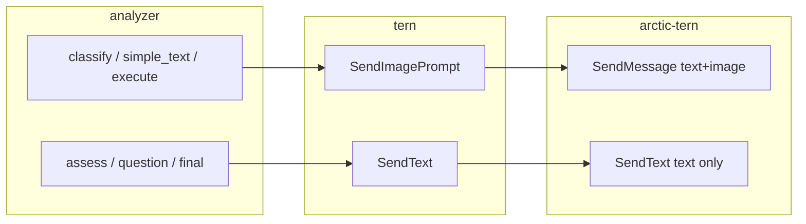

# 015 ImageToMarkdown Multimodal Vision Delivery

> **関連**: `014-ImageToMarkdown-NonInteractiveAgentGuard.md`（agent guard — 実装済み）、調査レポート `tmp/investigate/06_List_nightly_failure.md`

## 背景 (Background)

- `014` / plan `013` により `user_input_required` 自動応答・タイムアウト・`simple_text` 降格が導入され、**無限ハングは解消**した。
- しかし Nightly 手動検証（`06_List_出力選択.png`）は **未達**のままである（2026-07-12 調査）。
- 調査で判明した残存課題:
  1. **画像渡しがテキストパス参照のみ** — entext `tern.Client.SendText` はプロンプト末尾の `[Attached image: /abs/path]` 文字列だけを送り、arctic-tern v1 の **multimodal `SendMessage` / `ImageFile`** を使っていない。
  2. **Codex が Vision ではなく workdir 探索に逸脱** — 旧出力 MD に「作業ディレクトリ内の画像ファイルを特定し…候補が見つかりませんでした」と記録。plan-only テキスト後に shell 系ツールが走り、300s `agent idle timeout` で終了するケースがある。
  3. **`simple_text` 誤分類** — 06_List（2 列×4 行テーブル）は一貫して `simple_text` に分類され、Phase 1–4 の gap 判定を経由しない。013 の plan-only 降格は simple_text 到達後の話であり、**classify 段階失敗では未発動**。
  4. **プロンプトの shell 禁止が弱い** — `GenerateQuestionPrompt` には「OCR/shell 禁止・Vision のみ」があるが、`ClassifyPrompt` / `SimpleTextPrompt` には同等の明示がない。
- `014` 背景にあった「simple_text に `AttachedImageLine` なし」は plan `013` で修正済みだが、**文字列参照だけでは Codex が画像を開けない**ケースが 06_List で再現している。
- entext client の idle 監視は `ad9040f` で「初回 SSE イベント受信後に開始」へ修正済み（Codex コールドスタート誤 stall 対策）。本仕様は **画像認識の信頼性**に焦点を当てる。

### 用語

| 概念 | 定義 |
| :--- | :--- |
| **Multimodal 配信** | arctic-tern v1 `SendMessage` で `text` + `image`（base64）ContentPart を同一 POST する方式 |
| **Vision 必須呼び出し** | エージェントが添付画像を直接見て答える必要がある analyzer → tern の 1 回の Send |
| **テキストのみ呼び出し** | セッション文脈上、画像再送が不要な gap 判定・質問生成等 |
| **plan-only 応答** | 「まず〜します」等、成果物を返さず計画だけ述べる応答（`looksLikePlanOnly` 対象） |

## 要件 (Requirements)

### 必須要件

#### A. Multimodal 画像配信（tern + analyzer）

1. `internal/imagetomd/tern` に **Vision 必須呼び出し**用 API を追加すること。最低限:
   - `SendImagePrompt(ctx, sessionID, prompt, imagePath) (string, error)`
   - 内部で arctic-tern v1 `Session.SendMessage`（`text` + `image` ContentPart）を使用する。
   - arctic-tern 提供の `NewMessage().Text(prompt).ImageFile(path).Build()` または同等を利用する。
2. 上記 API も **`SendTextWithHandlers` と同等の agent guard**（`OnUserInputRequired` 自動応答、idle/total タイムアウト、`LastSendGuardEvents`）を適用すること（014 契約の維持）。
3. arctic-tern agentservice が multimodal 受信時に行う temp ファイル化 + prompt 注入と **整合**すること（entext 側で二重に `[Attached image:]` を付けても害はないが、**ContentPart による image 添付が必須**）。
4. 画像ファイル読み込み失敗時は typed error（例: `ErrImageReadFailed`）を返し、analyzer が wrap して CLI/API エラーとすること。
5. `tern.Client` 既存 `SendText` シグネチャは **テキストのみ呼び出し用に維持**する（014 後方互換）。

#### B. Vision 必須呼び出しの適用範囲（analyzer）

6. 次の analyzer 呼び出しは **必ず `SendImagePrompt`** を使うこと（対象画像 = 変換対象 PNG の絶対パス）:
   - **classify**（`BuildClassifyPrompt`）
   - **simple_text** 初回・retry（`BuildSimpleTextPrompt` / `BuildSimpleTextRetryPrompt`）
   - **Phase execute 回答**（`answerPrompt` — 既存どおり ref + AttachedImageLine 付きプロンプト）
7. 次は **テキストのみ `SendText` のまま**とすること（セッション文脈で画像再送不要）:
   - AssessGap
   - GenerateQuestion
   - 最終統合（`GenerateMarkdownPrompt` / retry）— セッション内 Phase 回答 corpus を入力
8. `sendPrompt` / `sendImagePrompt` いずれも `mergeGuardEvents` を呼ぶこと（014 継続）。

#### C. Vision-only プロンプト制約

9. `ClassifyPrompt` と `SimpleTextPrompt`（および retry 文言）に、**GenerateQuestionPrompt と同等**の制約を追加すること:
   - 外部ツール（OCR, tesseract, **shell**, ファイル探索コマンド等）の使用禁止
   - **自身の Vision 能力のみ**で即答
   - 作業ディレクトリ内のファイル検索で画像を探すな、**添付画像を直接読め**と明示
10. 上記は `NonInteractiveExecutionSuffix`（014）と併用し、二重付与を避けること。

#### D. classify / simple_text の誤分類・plan-only 対策

11. **classify 応答が plan-only**（`looksLikePlanOnly`）の場合:
    - 1 回だけ multimodal + 強化プロンプトで **classify を再試行**する。
    - 再試行後も plan-only または classify 失敗（typed error）の場合、**category を `complex_table` にフォールバック**し `runComplexPath` へ進む。
    - session log に `classify_fallback: { reason: "plan_only" | "error", retries: N }` を記録する。
12. **simple_text 初回応答が plan-only** の場合、013 どおり retry 後に complex 降格するが、**retry も multimodal** であること（013 の gap 補完）。
13. **テーブル形状ヒューリスティック（classify 補助）**: 分類プロンプトに「列見出しとデータ行からなる表形式（行数が少なくても）は `complex_table`」旨の 1 文を追加すること（06_List 型の誤 `simple_text` 抑制）。

#### E. 後方互換・014 契約

14. `014` の agent guard、タイムアウト、stall 時降格禁止、`ConvertImageToMarkdown` 公開 API 契約を **破壊しない**こと。
15. 既存 httptest 統合（`TestTernClientUserInputRequiredIntegration`）は引き続き PASS すること（mock server は multimodal POST を許容するよう拡張可）。
16. 依存: `github.com/axsh/arctic-tern v0.1.2` 以上（変更なし）。

### 任意要件

1. **最終統合**でも画像再送オプション（`--final-with-image` 相当）を AnalyzeOptions で切替可能にする（初版は不要、セッション corpus 依存のまま）。
2. multimodal POST の verbose ログ: `step=send_multimodal image=<basename> prompt_chars=<n>`。
3. 画像サイズ上限（例: 20MB）超過時の明示エラー。
4. `settings/tern/tern-config.yaml` の `idle_timeout_seconds` ドキュメント追記（Codex ツール実行が長い場合の Nightly 調整手順）。

## 実現方針 (Implementation Approach)

### アーキテクチャ



### tern 層

- `client.go` に `SendImagePrompt` を追加。`SendText` と handler / idle / total ロジックを **共通化**（内部 `sendWithHandlers(ctx, session, parts, handlers)`）。
- arctic-tern v1 に `SendImageWithHandlers` が無いため、entext 側で `SendMessage` → `stream.RunWithHandlers` を実装（`SendTextWithHandlers` と同型）。
- 単体テスト: httptest server が `content` JSON 内の `type: image` を検証するケースを追加。

### analyzer 層

- `sendImagePrompt(ctx, sessionID, prompt, absPath, log)` を追加し、要件 B の呼び出し元を置換。
- classify 分岐に plan-only 再試行 + complex_table フォールバック（要件 D）。
- `prompts.go`: `VisionOnlyConstraint` 定数を追加し Classify / SimpleText に注入。

### 014 との関係

| 項目 | 014 | 015 |
| :--- | :--- | :--- |
| user_input_required | entext tern | 変更なし（SendImagePrompt にも適用） |
| NonInteractiveExecutionSuffix | analyzer | 変更なし |
| simple_text 降格 | analyzer | multimodal 化 + classify フォールバック追加 |
| 画像参照 | テキスト `[Attached image:]` | **+ ContentPart image** |

## 検証シナリオ (Verification Scenarios)

### シナリオ 1: 06_List Nightly（実 LLM — 完了判定用）

1. `main` に本仕様実装をマージ後、リポジトリルートで次を実行する:
   ```bash
   go run ./cmd/image-to-markdown --tern-mode inproc \
     --tern-config ./settings/tern/tern-config.yaml \
     -i tmp/output/pc/images/06_List_出力選択.png \
     --output-dir tmp/output/pc/md --verbose
   ```
2. **10 分以内**にプロセスが終了すること（exit 0）。無限ハングしないこと。
3. 出力 `tmp/output/pc/md/06_List_出力選択.md` に次の行が **Markdown テーブルとして**含まれること:
   - `プレナビ` と列番号 `44`
   - `プレ管理` と列番号 `47`
   - `本ナビ` と列番号 `50`
4. verbose ログに `step=classify_done` が出力されること。
5. plan-only テキスト（「作業ディレクトリ内の画像ファイルを特定」等）が **最終 MD に含まれない**こと。

### シナリオ 2: 回帰 — 01_変更履歴（complex_table 経路）

1. 同コマンドで `01_変更履歴.png` を変換する。
2. 既存 MD と同等に No.43 / No.44 行が含まれること（007/008 回帰）。

### シナリオ 3: mock 契約 — multimodal POST

1. CI 上の httptest で classify 相当の `SendImagePrompt` が `content` に `type:image` を含む POST を送ることを検証する（LLM 非依存）。

## テスト項目 (Testing for the Requirements)

### ビルド・全体検証

1. ビルド＋単体テスト:
   ```bash
   ./scripts/process/build.sh
   ```

2. 統合テスト（image-to-markdown / multimodal 関連）:
   ```bash
   ./scripts/process/integration_test.sh --specify "ImageToMarkdown|Multimodal|AgentGuard|TernClient"
   ```

### 要件と検証の対応

| 要件 | 検証方法 |
| :--- | :--- |
| A1–A5 Multimodal API + guard | `internal/imagetomd/tern` `TestSendImagePromptIncludesImageContentPart`, `TestSendImagePromptHandlesUserInputRequired` |
| B6–B8 Vision / テキスト呼び出し分離 | `analyzer` `TestAnalyzeClassifyUsesSendImagePrompt`, `TestAnalyzeAssessGapUsesSendTextOnly`（recording mock） |
| C9–C10 Vision-only プロンプト | `prompts_test.go` `TestClassifyPrompt_ForbidsShellAndRequiresVision` |
| D11 classify plan-only → complex | `TestAnalyzeClassifyFallbackToComplexOnPlanOnly` |
| D12 simple_text multimodal retry | 既存 `TestAnalyzeSimpleTextRetriesOnInteractiveQuestion` の mock が image 送信を検証するよう拡張 |
| D13 テーブルヒューリスティック | `TestClassifyPrompt_MentionsSmallTableAsComplexTable` |
| E14–E16 014 回帰 | 既存 tern/analyzer テスト + 統合 `TestTernClientUserInputRequiredIntegration` PASS |
| シナリオ 1 | Nightly 手動（CI 必須外、014 と同方針） |
| シナリオ 2 | Nightly 手動または `--specify` 回帰セット |

### §11.4 セルフレビュー観点

- mock テストで「ContentPart に image が載る」ことを **LLM なし**で言い切れること。
- 06_List 実 LLM 成功は Nightly 任意だが、シナリオ 1 の手順を README に 014 と並記すること。

### Nightly / 任意（実 LLM）

```bash
go run ./cmd/image-to-markdown --tern-mode inproc \
  --tern-config ./settings/tern/tern-config.yaml \
  -i tmp/output/pc/images/06_List_出力選択.png \
  --output-dir tmp/output/pc/md --verbose
```

成功条件: シナリオ 1 の 2–5 を満たすこと。

> **Implementation plan**: `prompts/phases/000-foundation/branches/main/plans/014-ImageToMarkdown-MultimodalVisionDelivery.md`
