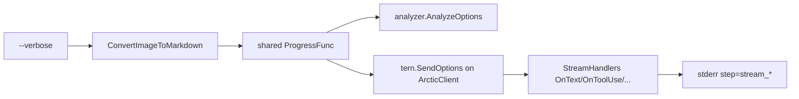

# 016 ImageToMarkdown Agent Stream Observability

> **関連**: `015-ImageToMarkdown-MultimodalVisionDelivery.md`（multimodal 実装済み）、`tmp/investigate/06_List_nightly_failure.md`、Nightly ログ `tmp/output/pc/md/06_List_nightly.stdout.log`（2026-07-12）

## 背景 (Background)

- plan `014`（multimodal）実装後の Nightly 再検証（`06_List_出力選択.png`）では、**約5分で classify が `classify_fallback reason=error`** となり、続く complex 経路が **`session busy`（HTTP 409）** で失敗した。
- arctic-tern agentservice ログには `events_sent=1` のみ記録され、**1 件目の SSE テキストの内容が不明**である。Codex が plan-only 文を返したのか、ツール呼び出し中に止まったのか、entext 側ログだけでは切り分けできない。
- 現行 `--verbose` は **analyzer のパイプライン段階**（`step=classify_done` 等）のみを stderr に出す。以下は **未接続・未実装**である:
  1. **entext `tern` クライアント**の `SendOptions.Progress` — `step=send_multimodal` / `step=stream_tool_use` / `step=agent_guard` が verbose でも出ない（`entext.go` が `runtime.Client` へ Progress を渡していない）。
  2. **`OnText` ストリームチャンク** — 集約のみでログ・session 保存なし。`events_sent=1` の実体が追えない。
  3. **`OnToolResult`** — 破棄されている（`_ = content`）。
- arctic-tern 側には **trace / debug ログ**が既に存在する（agentservice: `SSE stream event` + `content_preview`、Codex: `CLI stderr line`）が、committed `settings/tern/tern-config.yaml` は `log` セクション未設定（既定 `info`）のため Nightly 実行では有効化されていない。
- 06_List 調査を進めるには **Tern サーバー側の詳細ログ**と **entext クライアント側のストリーム trace** の**両方**が必要である（ユーザー確認済み）。

### 用語

| 概念 | 定義 |
| :--- | :--- |
| **パイプライン verbose** | analyzer が出す `step=phase_start` 等（現行 `--verbose`） |
| **ストリーム trace** | tern `SendMessage` の SSE 各イベント（text / tool_use / tool_result / error）を entext stderr に出すログ |
| **Tern trace ログ** | arctic-tern `log.level: trace` 時の agentservice / Codex プロセスログ |
| **content_preview** | arctic-tern trace が出す SSE 本文先頭（最大 100 文字） |

## 要件 (Requirements)

### 必須要件

#### A. Tern サーバー側観測（設定・ドキュメント）

1. **開発・Nightly 用**の trace 有効化手順をリポジトリに残すこと。最低限:
   - `settings/tern/tern-config.yaml` に `log` セクションを追加する、**または** `settings/tern/tern-config-trace.yaml`（trace 専用）を新設し README から参照する。
   - 推奨内容:
     ```yaml
     log:
       level: trace
       outputs:
         - type: stdout
     ```
2. trace 有効時に観測できること（arctic-tern v0.1.2 既存機能の利用、entext 変更不要）:
   - `message content`（送信プロンプト全文）
   - `SSE stream event`（`type` + `content_preview`）
   - `debug` 以上: Codex `CLI stderr line`（ツール・探索の手がかり）
3. README の `image-to-markdown` 節に **「エージェント応答の詳細観測」** サブセクションを追加し、以下を記載すること:
   - 通常: `--verbose`（entext パイプライン段階）
   - 詳細: `--tern-config settings/tern/tern-config-trace.yaml`（または trace 有効 config）+ ログを `tee` で保存する例
   - `.codex/sessions/.../rollout-*.jsonl` が残る条件（Codex セッション完走時）

#### B. entext クライアント側ストリーム trace

4. `--verbose` かつ `--quiet` でないとき、**tern クライアントの `SendOptions.Progress` を analyzer と同一コールバックに接続**すること（`ConvertImageToMarkdown` / `BuildRuntime` 経路）。
5. 接続により、既存の tern ログが stderr に出ること（014/015 で実装済みの行）:
   - `step=send_multimodal image=<basename> prompt_chars=<n>`
   - `step=stream_tool_use tool=<name>`
   - `step=agent_guard kind=user_input_required ...`
6. **新規**ストリーム trace を `SendOptions.Progress` 経由で追加すること:
   - `OnText`: 非空チャンクごとに `step=stream_text chars=<len> preview=<先頭120文字>`（改行は `\n` エスケープまたは空白化で 1 行に収める）
   - `OnToolResult`: `step=stream_tool_result chars=<len> preview=<先頭120文字>`
   - `OnError`（ストリームエラー文字列）: `step=stream_error msg=<先頭200文字>`
7. 上記 trace は **verbose 時のみ**出力すること。通常実行のログ量・性能への影響を最小化する。
8. ストリーム trace のプレフィクスは analyzer と同様 `[image-to-markdown] ` を付与すること（単一の stderr ストリームで grep 可能にする）。
9. **014/015 契約を破壊しない**こと: 応答集約ロジック、`ErrStreamStall` / agent guard、multimodal POST は変更しない（ログ追加のみ）。

#### C. テスト

10. `internal/imagetomd/tern` に httptest で `OnText` / `OnToolUse` trace が Progress に記録される単体テストを追加すること。
11. `entext` または `tests/` で、`ConvertImageToMarkdown` + mock tern + `--verbose` 相当の設定時に `step=stream_text` が stderr に含まれることを検証する統合テストを追加すること（LLM 非依存）。

### 任意要件

1. **session JSON** に `stream_trace_events`（種別・chars・preview・timestamp）を verbose 時のみ追記する（Nightly 後のオフライン分析用）。初版は stderr trace のみでも可。
2. CLI 専用フラグ `--trace-stream`（`--verbose` とは独立）でストリーム trace のみ ON にする。
3. `OnResult` 時に `step=stream_done text_chunks=<n> total_chars=<n>` を出す。

## 実現方針 (Implementation Approach)

### A. Tern trace 設定

- committed `settings/tern/tern-config-trace.yaml` を新設（本番既定 `tern-config.yaml` の `log.level` は `info` のまま維持し、trace は明示選択）。
- README に Nightly デバッグ手順を追記。

### B. entext ストリーム trace



1. `internal/imagetomd/tern/runtime.go`（または `BuildRuntime` 戻り値拡張）で `SendOptions` を注入可能にする。
   - 案: `RuntimeRequest.Progress ProgressFunc` を追加し、`NewClientWithSendOptions(endpoint, opts)` でクライアント生成。
2. `entext.go` `ConvertImageToMarkdown` で verbose 用 `Progress` を 1 つ定義し、analyzer と `BuildRuntime` の両方へ渡す。
3. `client.go` `sendMessageWithHandlers` の `OnText` / `OnToolResult` / `OnError` に trace 呼び出しを追加。プレビュー整形は `interactive.go` の `truncateRunes` を再利用または共有ヘルパ化。
4. ログ行は **1 イベント 1 行**（grep / `tee` 向け）。

### 変更対象ファイル（想定）

| ファイル | 変更 |
| :--- | :--- |
| `settings/tern/tern-config-trace.yaml` | 新規（trace 用） |
| `README.md` | 観測手順 |
| `internal/imagetomd/tern/runtime.go` | Progress 注入 |
| `internal/imagetomd/tern/client.go` | stream trace |
| `internal/imagetomd/tern/client_test.go` | trace 単体テスト |
| `entext.go` | Progress 共有配線 |
| `tests/image_to_markdown_stream_trace_test.go` | 統合テスト（新規） |

## 検証シナリオ (Verification Scenarios)

1. **単体: mock SSE で text チャンク trace**
   1. httptest が `type:text` を 2 回返す mock を用意する。
   2. `SendOptions.Progress` を recording し、`SendImagePrompt` を呼ぶ。
   3. Progress に `step=stream_text` が 2 回、`preview` に本文断片が含まれることを確認する。

2. **統合: 公開 API + verbose trace**
   1. mock tern が classify で `simple_text`、2 回目でテーブル Markdown を返す。
   2. `ConvertImageToMarkdown` を `Verbose: true` で実行する（stderr をキャプチャ）。
   3. stderr に `step=send_multimodal` と `step=stream_text` が含まれることを確認する。

3. **Nightly 観測（手動・CI 必須外）**
   1. 以下を実行し、ログを `06_List_trace.stdout.log` に保存する。
      ```bash
      go run ./cmd/image-to-markdown --tern-mode inproc \
        --tern-config ./settings/tern/tern-config-trace.yaml \
        -i tmp/output/pc/images/06_List_出力選択.png \
        --output-dir tmp/output/pc/md --verbose \
        2>&1 | tee tmp/output/pc/md/06_List_trace.stdout.log
      ```
   2. ログから以下を確認する（変換成功は必須としない。観測が目的）:
      - entext: `step=stream_text preview=...` で classify 中の Codex 応答断片が読める
      - entext: `step=stream_tool_use` があればツール名が分かる
      - arctic-tern trace: `SSE stream event` の `content_preview` が entext 側と整合する
      - classify 失敗時: `step=classify_fallback` の直前に plan-only 断片または tool_use が記録されている
   3. 上記が得られれば、06_List 失敗の次段調査（Vision 拒否 / workdir 探索 / session busy）に進める。

## テスト項目 (Testing for the Requirements)

### ビルド・全体検証

1. ビルド＋単体テスト:
   ```bash
   ./scripts/process/build.sh
   ```
   - 確認: `internal/imagetomd/tern` の stream trace 単体テスト PASS。

2. 統合テスト（ImageToMarkdown / Tern 関連に限定）:
   ```bash
   ./scripts/process/build.sh && ./scripts/process/integration_test.sh --specify "ImageToMarkdown|StreamTrace|TernClient|Multimodal|AgentGuard"
   ```
   - 確認: 新規 `TestImageToMarkdownStreamTraceIntegration`（仮称）PASS。
   - 確認: 既存 `TestImageToMarkdownMultimodalClassifyIntegration` / `TestTernClientUserInputRequiredIntegration` がリグレッションしない。

### 要件トレーサビリティ

| 要件 | 検証 |
| :--- | :--- |
| A1–A3 Tern trace 設定・README | 手動: trace config で `SSE stream event` が stdout に出る（シナリオ 3） |
| B4–B8 entext Progress 接続・stream trace | 単体テスト + 統合テスト（シナリオ 1–2） |
| B9 014/015 非破壊 | 既存 AgentGuard / Multimodal 統合テスト PASS |
| C10–C11 自動テスト | build + integration 上記 |

---

> **Implementation plan**: `prompts/phases/000-foundation/branches/main/plans/015-ImageToMarkdown-AgentStreamObservability.md`
