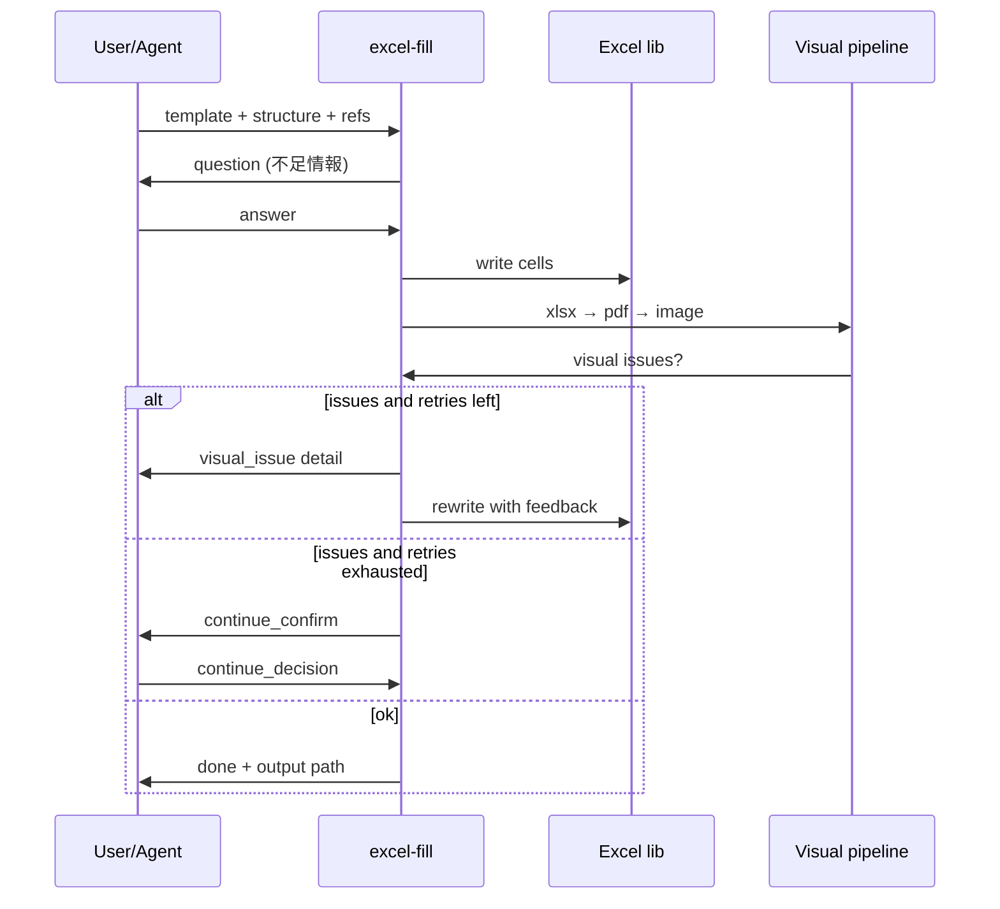

# 017 ExcelFill Template Analyze And Fill

> **関連**: `000-Portable-ExcelPdfImageMarkdown.md`（変換 CLI 契約）、`011-ImageToMarkdown-ExcelCsvHint.md`（Excel セル値の機械読取）、既存パイプライン `excel-to-pdf` → `pdf-to-image` → `image-to-markdown`

## 背景 (Background)

- 定型の Excel テンプレートへ、対話や外部エージェントから得た情報を埋め込んで成果物を作りたい需要がある。
- 現行の entext は Excel → PDF → 画像 → Markdown の**読み取り・変換**は整っているが、**テンプレート構造の意味理解**と**セルへの書き込み・見た目検証ループ**は未整備である。
- テンプレートは見た目（結合・見出し帯・記入欄の意味）とセル座標の両方を理解しないと、誤ったセルへの書き込みや、はみ出し・表示欠けを防げない。
- そのため、(A) テンプレート解析で編集用参照 Markdown を作る機能と、(B) 対話で情報を集め埋め込み・見た目検証する機能を、独立 CLI として提供する。

### 用語

| 概念 | 定義 |
| :--- | :--- |
| **テンプレート Excel** | 記入前の `.xlsx` / `.xlsm` 等。書式・結合・見出しが既に入っている想定 |
| **構造 Markdown** | 画像解析＋セル対応の結果をまとめた、編集時の主参照ドキュメント |
| **参照 Markdown** | 構造 Markdown 以外の補足資料（ルール、用語集、過去成果など） |
| **対話モード `json`** | stdio 上で JSON 行（またはメッセージ）を相互交換する機械連携モード |
| **対話モード `text`** | 人間向けの自然言語テキストのみでやり取りするモード |
| **見た目検証** | 埋めた Excel を画像化し、文字欠け・はみ出し等を検出する工程 |
| **リトライ上限** | 見た目問題を検知したときの再埋め込みループの規定回数（既定 5） |

## 要件 (Requirements)

### 必須要件

#### A. 全体構成

1. 次の **2 つの独立 CLI** を提供すること（既存 `excel-to-pdf` 等と同型の Go + cobra + viper）。
   - `excel-template-analyze` … テンプレート解析 → 構造 Markdown 出力
   - `excel-fill` … 対話・埋め込み・見た目検証ループ → 最終 Excel 出力
2. 両 CLI とも公開 Go API からも同等機能を呼べること（CLI 専用実装にしない）。
3. 既存の標準 I/O・終了コード契約を維持すること。
   - 成功: `0`
   - 引数不正/入力不正: `2`
   - 実行時エラー（埋め込み失敗、リトライ上限到達後の打ち切りなど）: `1`
   - `stdout`: 機械可読（成果物パス、または JSON）
   - `stderr`: 人間向けログ・警告・エラー
4. `--config` / `--verbose` / `--quiet` / `--output-mode path|json` を既存ツールと同様にサポートすること。

#### B. `excel-template-analyze`（テンプレート解析）

5. 入力としてテンプレート Excel（`-i` / `--input`）を必須とすること。
6. 解析は次の **2 系統を順に組み合わせ**、最終的に **1 つの構造 Markdown** を出力すること。

   **系統 1: 画像解析（構造の意味理解）**
   - 既存パイプライン（`excel-to-pdf` → `pdf-to-image`、必要なら `image-to-markdown` 相当の Vision 解析）を再利用し、シートの見た目・見出し・記入欄の意味・セクション構造を把握すること。
   - 「どの領域が何を埋める欄か」「固定ラベルと可変入力の区別」など、**意味レベルの構造**を Markdown に残すこと。

   **系統 2: ライブラリ経由の Excel 読込（セル対応）**
   - Excel ライブラリ（例: excelize 等。実装計画で選定）でブックを開き、シート名・セル番地・結合範囲・表示値などを機械的に取得すること。
   - 系統 1 で得た意味構造と、セル番地・範囲を対応づけた対応表を構造 Markdown に含めること。
   - 既存 `excel-to-csv` のセル値抽出知見を再利用してよい（ただし本機能の主成果は Markdown）。

7. 構造 Markdown には、少なくとも次を含めること（見出し名・順序は実装で調整可）。
   - ブック/シート概要
   - 意味構造（セクション、ラベル、記入欄の役割）
   - セル対応表（記入欄 ID またはラベル ↔ シート名・セル番地/範囲）
   - 編集時の注意（結合セル、入力長の制約が分かる場合はその記述）
   - 解析メタデータ（入力パス、解析日時、使用バックエンド等の要約）
8. 出力は `-o` / `--output`（単一 Markdown）または `--output-dir` で受け取れること。複数シート時は 1 ファイルに統合するかシート別ファイルにするかを実装計画で定め、仕様上は「編集時に一意に参照できる成果物」であること。
9. 解析の中間成果（PDF/画像/CSV/session）は作業ディレクトリに残せるオプション（例: `--keep-work-dir`）を持つこと。既定は一時ディレクトリを掃除してよい。

#### C. `excel-fill`（対話・埋め込み・見た目検証）

10. 必須オプション:
    - `--template` … テンプレート Excel
    - `--structure` … `excel-template-analyze` が出力した構造 Markdown
    - `-o` / `--output` … 最終 Excel の出力パス
11. 参照 Markdown を複数指定できること。
    - `--ref` … 正規表現パターン（既存 `image-to-markdown` の `-r` と同趣旨。複数回指定可）
    - `--ref-dir` … ディレクトリ指定（配下の `.md` を再帰または非再帰で読込。深さは実装計画で定める）
    - 両方の併用を許可する。重複パスは一度だけ読むこと。
12. 対話モードを `--mode json|text` で選択できること（既定は `text`）。
    - **`text`**: stdin/stdout（または stderr への質問と stdin からの回答）で自然言語のみやり取りする。
    - **`json`**: stdio で JSON メッセージを相互交換する。1 メッセージは改行区切り JSON（NDJSON）を基本とし、スキーマは実現方針に定める最小セットを満たすこと。
13. 対話では、構造 Markdown と参照 Markdown を前提に、次を行うこと。
    - 埋めるために必要な情報の聞き取り
    - 不足情報・曖昧な点の確認
    - ユーザー（または連携エージェント）からの回答の収集
14. 収集した情報を元に、テンプレート Excel の対応セルへ値を書き込み、中間 Excel を保存すること。
15. 埋め込み後、**見た目検証ループ**を実行すること。
    1. 埋めた Excel を保存
    2. 既存変換で画像化（`excel-to-pdf` → `pdf-to-image`）
    3. 画像を解析し、少なくとも次の問題を検出すること:
       - 文字の表示欠け（セル内で切れている）
       - はみ出し（隣接セル・枠外への侵食が視覚的に分かる場合）
       - その他、記入結果として明らかに壊れているレイアウト（検出可能な範囲）
    4. 問題があれば、**問題の詳細説明**を生成し、次の埋め込みラウンドの追加インプットとして渡して再作成すること
16. リトライ回数を `--max-retries` で指定できること。**既定値は 5**。
    - 規定回数に達しても問題が残る場合は、エラーとして現状の問題一覧を報告し、**継続ループするかどうかを対話で確認**すること。
    - 継続する場合は、追加のリトライ上限（対話または `--continue-retries` 等）を決めて再開できること。
    - 継続しない場合は終了コード `1` で終了し、最後に保存した Excel パスと問題報告を残すこと。
17. 問題が無い（または許容と判断された）場合、最終版 Excel を `-o` に保存して終了すること（終了コード `0`）。
18. `json` モードでは、質問・不足情報・見た目問題・継続確認・完了通知がすべて JSON メッセージで表現されること。`text` モードでは同等の内容を人間可読テキストで行うこと。
19. LLM / Coding Agent を用いる場合は、既存 `image-to-markdown` と同様に Tern 接続設定（`--server-url` / `--tern-mode` / `--tern-config` / `--agent` / `--model` 等）を引き継げること。

#### D. 非機能・品質

20. テンプレート原本を破壊しないこと。書き込みはコピー上で行い、最終成果のみ `-o` に出すこと。
21. Windows を主対象としつつ、ライブラリ読取/書込パスは可能な限りクロスプラットフォームにすること。見た目検証の PDF 化は既存 backend 選択（`auto` / `excel-com` / `libreoffice`）に従うこと。
22. 単体テストで、セル対応の読取・書込・リトライカウンタ・対話プロトコルのパースを LLM なしで検証できること。
23. 統合テストで、フィクスチャ Excel を用いた analyze → fill（モック対話または固定回答）の一連を自動検証できること。

### 任意要件

1. `--sheets` で解析・埋め込み対象シートを限定する。
2. 見た目検証の厳しさ（`--visual-strict`）や、特定問題種別の無視リスト。
3. 対話セッションログ（JSON）の保存（`--session-log`）。
4. `excel-fill` に「非対話一括モード」（必要な埋め込みデータを JSON ファイルで渡し、質問をスキップ）を追加する。
5. 構造 Markdown のスキーマ version フィールド（将来のフォーマット進化用）。

## 実現方針 (Implementation Approach)

### 1. パイプライン上の位置づけ

```text
[テンプレート .xlsx]
        │
        ▼
 excel-template-analyze
   ├─ (画像) excel-to-pdf → pdf-to-image → Vision 意味解析
   └─ (セル) Excel ライブラリ読取 + 必要なら excel-to-csv
        │
        ▼
  構造 Markdown (.md)
        │
        ▼
 excel-fill (--template, --structure, --ref/--ref-dir, --mode, --max-retries)
   ├─ 対話 (text | json/stdio) で不足情報収集
   ├─ セル書き込み → 中間 xlsx
   ├─ 画像化 → 見た目検証 ──問題あり──► 問題詳細を次ラウンド入力へ（≤ max-retries）
   └─ OK → 最終 xlsx を -o に保存
```

### 2. CLI 案

#### `excel-template-analyze`

```bash
bin/entext/excel-template-analyze \
  -i samples/template.xlsx \
  -o tmp/structure/template_structure.md \
  --keep-work-dir tmp/analyze-work \
  --verbose
```

#### `excel-fill`

```bash
bin/entext/excel-fill \
  --template samples/template.xlsx \
  --structure tmp/structure/template_structure.md \
  --ref "docs/rules/.*\\.md" \
  --ref-dir docs/glossary \
  --mode text \
  --max-retries 5 \
  -o tmp/output/filled.xlsx
```

JSON モード例（エージェント連携）:

```bash
bin/entext/excel-fill ... --mode json < agent_requests.ndjson
```

### 3. パッケージ構成（想定）

| 領域 | 配置案 |
| :--- | :--- |
| テンプレート解析 | `internal/excelanalyze/` |
| 埋め込み・対話・検証ループ | `internal/excelfill/` |
| Excel セル I/O | `internal/excelcell/`（読取/書込の薄いラッパ。ライブラリ依存をここに閉じる） |
| CLI | `cmd/excel-template-analyze/`, `cmd/excel-fill/` |
| 公開 API | `entext.go` に `AnalyzeExcelTemplate` / `FillExcel`（名称は実装計画で確定） |

既存の `internal/exceltopdf` / `internal/pdftoimage` / `internal/imagetomd` / `internal/exceltocsv` は**呼び出し側から再利用**し、変換ロジックの複製は避ける。

### 4. 構造 Markdown の役割

- 編集エージェント（または fill 内部の LLM）が「どこに何を書くか」を決めるための**唯一の主地図**とする。
- 画像由来の意味記述と、ライブラリ由来のセル番地を同一ドキュメント内で対応づける。
- 参照 Markdown（`--ref` / `--ref-dir`）は補足コンテキストであり、セル座標の正本は構造 Markdown とする。

### 5. 対話プロトコル（`json` モード最小スキーマ）

NDJSON。方向は `role: "assistant" | "user" | "system"`、種別に `type` を用いる。

| type | 方向 | 用途 |
| :--- | :--- | :--- |
| `question` | assistant → | 不足情報の質問（`fields`, `prompt`） |
| `answer` | user → | 回答（`fields` または自由文 `text`） |
| `status` | assistant → | 進捗（埋め込み中、検証中など） |
| `visual_issue` | assistant → | 見た目問題の詳細と再作成方針 |
| `continue_confirm` | assistant → | リトライ上限到達時の継続確認 |
| `continue_decision` | user → | `continue: true/false` と任意の追加上限 |
| `done` | assistant → | 完了（`output_path`, `retries_used`） |
| `error` | assistant → | 打ち切りエラー（問題一覧付き） |

`text` モードは上記と同内容をプレーンテキストで表現し、プロトコル互換レイヤは内部で共通化する。

### 6. 見た目検証

- 画像化は既存 backend を使用。
- 検出は Vision / Agent に「文字欠け・はみ出し」を明示指示するプロンプトで行う（初版）。
- 検出結果は構造化（問題セル候補、現象、推奨修正）し、次ラウンドの埋め込み入力に必ず添付する。
- リトライカウンタは「見た目検証で問題あり → 再埋め込み」を 1 回と数える。初回埋め込みはカウント外、または「検証失敗回数」として定義を実装計画で固定する（推奨: **検証失敗回数**が `--max-retries` に達したら確認）。

### 7. 設計上の重要決定

1. **解析と埋め込みを CLI 分離**する（再利用・テスト容易性のため）。
2. **セル書き込みはライブラリ**、**見た目の正は画像検証**とする（ライブラリだけではフォントのはみ出しを保証できない）。
3. **対話の 2 モードは同一コア**に載せ、入出力アダプタだけ分ける。
4. 既存変換ツールの I/O 契約・exit code を踏襲し、 entext 公開 API から一貫利用可能にする。



## 検証シナリオ (Verification Scenarios)

1. **テンプレート解析（単一シート）**
   1. 記入欄と固定ラベルが混在するサンプル Excel を用意する。
   2. `excel-template-analyze -i <template> -o <structure.md>` を実行する。
   3. 構造 Markdown に、意味上の記入欄説明と、対応するセル番地が両方含まれることを確認する。
2. **参照の一括読込**
   1. 複数の参照 Markdown をディレクトリと正規表現の両方で用意する。
   2. `excel-fill` に `--ref` と `--ref-dir` を同時指定する。
   3. 重複ファイルは一度だけ読まれ、対話コンテキストに含まれることを確認する。
3. **text モードでの埋め込み**
   1. 構造 Markdown 付きで `excel-fill --mode text` を起動する。
   2. 不足項目を聞かれ、回答を入力する。
   3. セルが埋まった Excel が出力されることを確認する。
4. **json モードでの連携**
   1. `--mode json` で起動し、`question` に対して `answer` を NDJSON で返す。
   2. 完了時に `done` メッセージと出力パスが得られることを確認する。
5. **見た目検証リトライ**
   1. 意図的に長い文字列を渡し、はみ出し/欠けが起きる状況を作る。
   2. 問題詳細が次ラウンド入力に付き、再埋め込みされることを確認する。
   3. `--max-retries 5`（既定）で上限に達したら `continue_confirm`（text なら同等の確認）が出ることを確認する。
   4. 継続しない場合は exit `1`、継続する場合は追加ループできることを確認する。
6. **成功終了**
   1. 適切な長さの入力で埋め込み、見た目検証が通る。
   2. `-o` に最終 Excel が保存され、exit `0` となる。

## テスト項目 (Testing for the Requirements)

### 要件との対応

| 要件 | 検証手段 |
| :--- | :--- |
| B. 解析（画像＋セル対応→Markdown） | 単体: セル対応表生成。統合: フィクスチャ Excel → 構造 Markdown に番地が含まれる |
| C. 参照 `--ref` / `--ref-dir` | 単体: パターン解決・重複排除 |
| C. `text` / `json` 対話 | 単体: プロトコル encode/decode。統合: 固定回答での fill |
| C. セル書き込み | 単体: 指定番地への値反映（ライブラリ） |
| C. 見た目検証ループ・`--max-retries` 既定 5 | 単体: カウンタと continue 分岐。統合: モック検証器で issue → retry → confirm |
| A/D. CLI 契約・exit code | 統合: 引数不正で 2、成功 0、打ち切り 1 |
| 公開 API | 単体/統合: CLI と同じコア関数を直接呼ぶ |

### ビルド・全体検証

1. ビルド＋単体テスト:
   `scripts/process/build.sh`

2. 共通・変換系のリグレッション（既存 Excel パイプライン影響確認）:
   `scripts/process/integration_test.sh --categories "common" --specify "excel|Excel|sheet"`

3. 本機能の統合テスト（実装後に追加するテスト名に合わせて specify を調整）:
   `scripts/process/integration_test.sh --categories "common" --specify "ExcelTemplate|ExcelFill|excel-template-analyze|excel-fill"`

4. LLM を実呼びする経路がある場合のみ（開発中はモック優先。実 LLM は限定実行）:
   `scripts/process/integration_test.sh --categories "llm" --specify "ExcelFill|ExcelTemplate"`

> 影響しない `taskengine` / `template` / `gui` カテゴリは本仕様の検証対象に含めない。
)